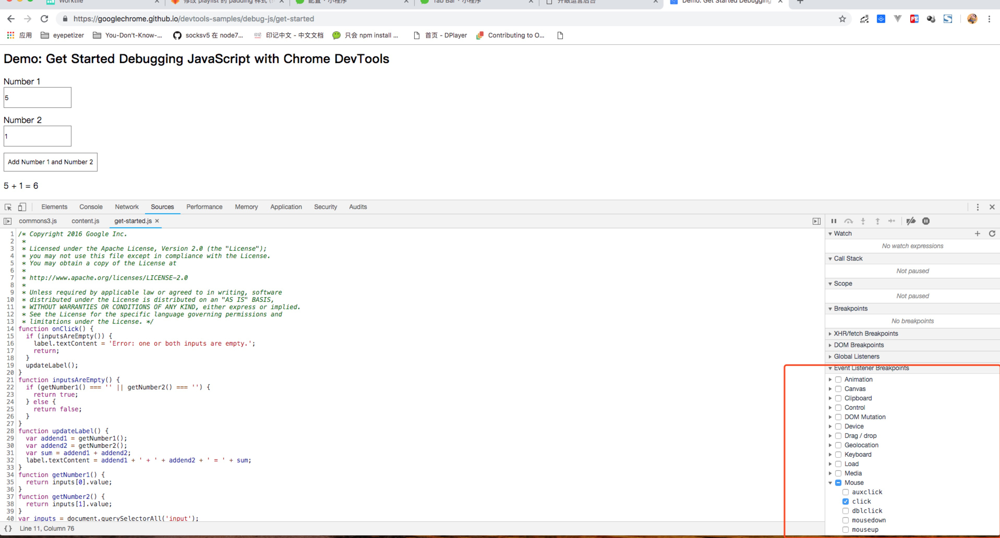
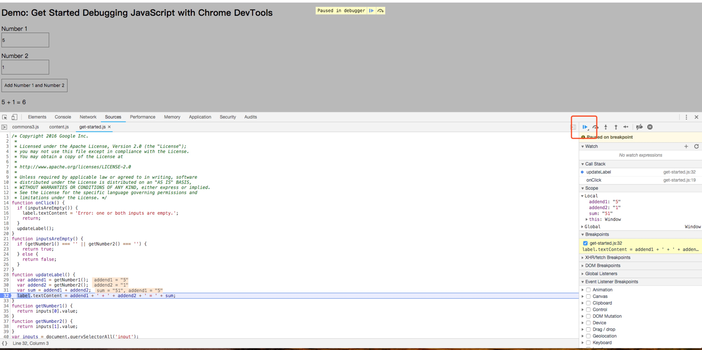
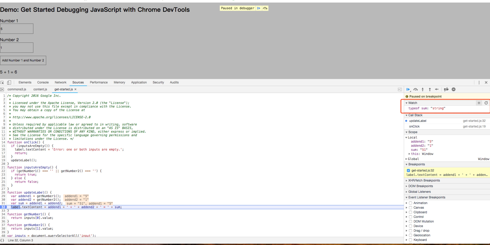

## google浏览器开发者工具如何使用断点

作为一个开发者，怎么找到和修复 bug 可能是经常出现的问题，可能经常使用 console.log() 把代码值打印在控制台看是否正确；这里，它将彻底的改变了。   
这里会介绍怎么正确的 debugging，也将学到怎么使用 Chorme Developer Tools 设置断点在代码里面逐行执行，这样就能高效的发现和解决出现在代码里面的一些问题。   
本文的目标是展示怎样修复一个特殊的 bug，用工作流程的方式有助于学习。

### 1. 复现 Bug
复现 bug 是找出并修复 bug 的第一步，复现 bug 意味着用一系列的方法来找出当前导致 bug 的代码位置。而复现 bug 需要很久的时间，因此就需要用便捷的方法去掉不需要的步骤。   
跟随下面的步骤说明来复现并修复一个问题：
- 这里有一个网页在教程中作为 demo，请确定你已经用一个新的 tab 在浏览器打开， [open demo](https://googlechrome.github.io/devtools-samples/debug-js/get-started)；
- 在示例网页中，在 Number 1 的输入框输入 5，在 Number 2 的输入框输入 1；
- 点击 Add Number 1 And Number 2；
- 查看最终输出的结果是： `5 + 1 = 51`；

噢。。。为什么结果错了，正确的不应该是 `6` 吗？这个 bug 就需要去找出并修复它。

### 2. 通过断点(breakpoint)暂停代码的执行
开发者工具让你在代码的执行过程中暂停你的代码执行，并且在当前暂停时刻可以查看所有变量的值；这里能暂停代码执行的就是断点(breakpoint)。
- 回到示例网页，通过快捷键Command + Option + I(Mac) 或者 Control + Shift + I(windows,linux)；
- 点击 Sources 面板；
- 点击右侧的 *Event Listener Breakpoints* 并展开，开发者工具会显示出一个事件分类列表，如 *Animation* 和 *Clipboard*；
- 接着移动到 *Mouse* 事件类型，并展开它；
- 选中里面的 *click* 多选框；

- 回到示例，再次点击 Add Number 1 And Number 2，在 sources 面板下方暂停并高亮显示了代码在具体的一行：
``` javascript
  function onClick() {
```
**为什么停留在这里？**   
当选中了 click 之后，前面设置的基础事件断点在所有的 `click` 事件上。当任何节点被点击的时候，当前节点都会有一个 `click` 事件处理程序，开发者工具会自动暂停在节点调用的 `click` 事件处理程序的第一行。

### 一步一步执行代码
当 script 错误代码执行时肯定会出现问题，在这时尽可能的逐行执行代码，明确的找出和期望的执行结果不同的地方在哪里；
- 在开发者工具的 *Source* 面板，单击 *Step into next function call*

这个按钮允许你逐步执行 `onClick` 函数；当开发者工具高亮强调以下代码并暂停时：
``` javascript
  if (inputsAreEmpty()) {
```
- 现在你可以单击 *Step over next function call* 按钮

它告诉开发者工具执行函数 `inputsAreEmpty` 但不进入其内部。

### 设置其他的断点
一行一行的执行是打断点的常见方式，如果你再某一行得到了特殊的信息并且想暂停执行的时候，直接在想暂停的那一行前面的数值处单击一下就会出现一个蓝色的符号，这就是断点，当我们执行的时候，在这里总是会暂停下来：
- 找到函数 `updateLabel()`，其中可以看到如下代码：
``` javascript
  label.textContent = addend1 + ' + ' + addend2 + ' = ' + sum;
```
- 点击 *Resume script execution* 按钮

代码会继续执行，直到到达刚才在函数 `updateLabel()` 最后一行打的断点处停止。
- 在这里我们可以看到函数 `updateLabel()` 暂停后的所有变量 `addend1`、`addend2`和`sum`的值，最终发现这里的 `sum` 值是一个字符串类型值，而我们期望得到的数字类型值，可能 bug 就是这个原因导致的。

### 检查变量值
变量类型和我们期望的类型值不一样时也是导致问题的另一个常见问题，很多开发者都是通过 `console.log()` 看所有变量的结果，而 `console.log()` 无聊和无效又可能有另外的两个原因；第一，你需要在代码中大量的编写 `console.log()`；第二，你可能不知道导致问题是哪个具体的变量，因此要 `console.log()` 大量的变量；   
在开发者工具中一个替代 `console.log()` 的方法就是使用 *Watch Expressions*，使用 *Watch Expressions* 时刻监视变量值；换言之，*Watch Expressions* 不仅仅局限于变量，你还能用 *Watch Expressions* 存储和验证 *Javascript expressions*；
- 在开发者工具的 *Sources* 面板上，单击 *Watch* 并展开
- 单击 *Add Expression*

- 在点击 + 号后的输入栏输入 `typeof sum`
- 回车后，可以看到结果是 `typeof sum: "string"`，这里就是我们使用 *Watch Expressions* 监视的结果
这里得到的是一个字符串的值，而我们需要的是数字值，猜测应该是这儿导致的问题，即将变量 `addend1` 和 `addend2` 在控制台利用 进行强制转换后并使用 `console.log(parseInt(addend1) + parseInt(addend2))` 打印出结果是正确的，那么问题就找到了。  
最后，通过上面的步骤进行处理，找到了最终导致问题的代码，修复即可。
