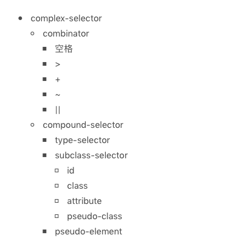

# CSS语法：除了属性和选择器，你还需要知道这些带@的规则

CSS 是前端工程师每天必不可少的必修课，那么它的资料又是怎样的呢，说起来真的很糟糕，这是因为 CSS 并没有像 HTML 和 JavaScript 那样的一份标准文档。  
  
[在这里](https://www.w3.org/TR/?title=css) 我们一共能看到98份 CSS 相关的标准，它们各自从不同的角度规定了 CSS 的特性。将 working draft 状态的去掉后仍可以得到 22 份候选标准和 6 份推荐标准。对于这些知识，怎么才能把这些离散的标准组织成易于理解及记忆的形式？  
  
这里，根据 winter 老师的经验，他提供的方法是根据 CSS 语法来进行，任何 CSS 的特性都必须通过一定的语法结构表达出来，所以语法可以帮助我们发现大多数的 CSS 特性，因此了解一波[CSS 语法的最新标准，看这里](https://www.w3.org/TR/css-syntax-3/);这篇文档阅读体验比较差，幸好，winter 老师给我们做了总结抽取(跟着大佬走准没错)，接下来一起看看。  
  
在标准中可以看到，去除空格、HTML 注释等无效信息，**CSS 的顶层样式表由两种规则组成的规则列表构成，一种被称为 at-rule，也就是 at 规则，另一种是 qualified rule，也就是普通规则。**  
  
at-rule 由一个 @ 关键字和后续的一个区块组成，如果没有区块则以分号结束；这些 at-rule 在开发中使用机会远远小于普通的规则，因此大部分内容可能比较陌生。  
  
这些 at 规则正式掌握 CSS 的高级特性所必须的内容；而 qualified rule 则是普通的 CSS 规则，也就是我们熟悉的，由选择器和属性指定构成的规则。  
  
## at 规则

既然已经知道了 CSS 语法的整体结构，那么就可以将所有的规则进行整理；(winter 老师的课程中提供了所有内容，感谢)

- @charset: [https://www.w3.org/TR/css-syntax-3/](https://www.w3.org/TR/css-syntax-3/)
- @import: [https://www.w3.org/TR/css-cascade-4/](https://www.w3.org/TR/css-cascade-4/)
- @media: [https://www.w3.org/TR/css3-conditional/](https://www.w3.org/TR/css3-conditional/)
- @page: [https://www.w3.org/TR/css-page-3/](https://www.w3.org/TR/css-page-3/)
- @counter-style: [https://www.w3.org/TR/css-counter-styles-3/](https://www.w3.org/TR/css-counter-styles-3/)
- @keyframes: [https://www.w3.org/TR/css-animations-1/](https://www.w3.org/TR/css-animations-1/)
- @fontface: [https://www.w3.org/TR/css-fonts-3/](https://www.w3.org/TR/css-fonts-3/)
- @supports: [https://www.w3.org/TR/css3-conditional/](https://www.w3.org/TR/css3-conditional/)
- @namespace: [https://www.w3.org/TR/css-namespaces-3/](https://www.w3.org/TR/css-namespaces-3/)

这里的每一种 @ 规则背后都是一组 CSS 的知识，这里为了简历一个整体的认识，会给所有的 @ 规则提供一些简单的例子。(有些会比较重点的介绍)

## @charset

@charset 用于提示 CSS 文件使用的字符编码方式，它如果被使用，必须出现在文件最前面；此规则只在给出语法解析阶段前使用，并不影响页面上的展示效果。  

``` javascript
@charset "utf-8"
```

## @import

@import 用于引入一个 CSS 文件，除了 @charset 规则不会被引入，@import 可以引入另一个文件的全部内容。

``` javascript
@import "mystyle.css"
@import url("mystyle.css")

@import [ <url> | <string> ]
        [ supports( [ <supports-condition> | <declaration> ] )]?
        <media-query-list>? ;
```

通过代码可以看出，import 还支持 supports 和 media query 形式。

## @media

media 就是常用的 media query 使用的规则了，它能够对设备的类型进行一系列判断，在 media 的区块内，是普通的规则列表。

``` javascript
@media print {
  body {
    font-size: 12px;
  }
}
```

## @page

@page 用于分页媒体访问网页时的表现设置，页面是一种特殊的盒模型结构，除了页面本身，还可以设置它周围的盒。

``` javascript
@page {
  size: 8.5in 11in;
  margin: 10%;

  @top-left {
    content: "Hamlet";
  }
  @top-right {
    content: "Page " counter(page);
  }
}
```

## @counter-style

@counter-style 产生一种数据，用于定义列表项表现。

``` javascript
@counter-style triangle {
  system: cyclic;
  symbols: ‣;
  suffix: " ";
}
```

## @keyframes

@keyframes 产生一种数据，用于定义动画关键帧。

``` javascript
@keyframes diagonal-slide {
  from {
    left: 0;
    top: 0;
  }

  to {
    left: 100px;
    top: 100px;
  }
}
```

## @fontface

@fontface 用于定义一种字体， icon font 技术就是利用这个特性来实现的。

``` javascript
@font-face {
  font-family: Gentium;
  src: url(http://example.com/fonts/Gentium.woff);
}

p {
  font-family: Gentium, serif;
}
```

## @supports

@supports 检查环境的特性，它与 media 比较类似。

## @namespace

@namespace 用于跟 XML 命名空间配合的一个规则，表示内部的 CSS 选择器全都带上特定命名空间。

## @viewport

@viewport 用于设置视口的一些特性，不过兼容性不是很全，多数时候被 html 的 meta 代替。

## 其它

除了上面这些，还有一些不太推荐的 at 规则：

- @color-profile 是 SVG1.0 引入的 CSS 特性，但是实现状况不好
- @document 还在讨论，推迟到了 CSS4 中
- @font-feature-values等

## 普通规则

接下来进入的是 qualified rule，也就是普通规则部分，qualified rule 主要是由选择器和声明区块构成，声明区块又由属性和值构成；下面介绍了这部分的语法的组成要点：

- 普通规则
  - 选择器
  - 声明列表
    - 属性
    - 值
      - 值的类型
      - 函数

## 选择器

先看看选择器，它有一份独立的标准，可以参考这里[https://www.w3.org/TR/selectors-4/](https://www.w3.org/TR/selectors-4/)；这份标准属于 CSS 和 HTML 的共用标准。  
  
关于选择器，这里从语法的角度对其进行记忆，并附上一张选择器的语法表，通过语法表清楚的进行记忆。  
  
从语法结构可以看出，任何选择器都是有几个符号结构连接的，如：空格、大于号、加号、波浪线、双竖线，这里需要注意的是空格即为后代选择器的优先级较低。  
  
对每一个选择器来说，如果它不是伪元素的话，由几个可选的部分组成，标签类型选择器、id、class、属性和伪类，它们中只要出现一个，就构成了选择器；如果是伪元素，则在这个结构之后追加伪元素，只有伪类可以出现在伪元素之后，通过 winter 老师的讲解，这里有一个选择器的语法结构：  
  
再通过一个示例图：  
  
  
选择器的语法看完，看一下声明部分的语法。  
  
## 声明：属性和值

声明部分是一个由“属性：值”组成的序列。  
  
**属性**是由中划线、下划线、字母等组成的标识符，CSS 还支持使用反斜杠转义；需要注意的是：属性不允许使用连续的两个中划线开头，这样的属性会被认为是 CSS 变量。  
  
在 [CSS Variables 标准](https://www.w3.org/TR/css-variables/)中，以双中划线开头的属性被当做变量，与之配合的则是 var 函数：

``` javascript
:root {
  --main-color: #06c;
  --accent-color: #006;
}
/* the rest of the css file */
#foo h1 {
  color: var(--main-color);
}
```

**值**的部分，主要在[标准CSS Values and Unit](https://www.w3.org/TR/css-values-4/)，根据每个 CSS 属性可以取到不同的值，这里的值可能是字符串、标识符；其属性值可能是以下类型：

- CSS 范围的关键字： initial,unset，inherit，任何属性都可以的关键字
- 字符串：比如 content 属性
- URL：使用 url() 函数的 URL 值
- 整数/实数：比如 flex 属性
- 维度：单位的整数/实数，比如 width 属性
- 百分比：大部分维度都支持
- 颜色：比如 background-color 属性
- 图片：比如 background-image 属性
- 2D 位置：比如 background-position 属性
- 函数：来自函数的值，比如 transform 属性

这里重点介绍一下函数，一些属性会要求产生的函数类型值，比如 easing-funciton 会要求 cubic-bezier() 函数的值；CSS 支持一批特定的计算型函数：

- calc()
- max()
- min()
- clamp()
- toggle()
- attr()

**calc()** 函数是基本的表达式计算，它支持加减乘除四则运算，在针对维度进行计算时，calc() 函数允许不同单位混合运算，比较 nice。如下：

``` javascript
section {
  float: left;
  margin: 1em;
  border: 1px solid #333;
  width: calc(100% / 3 - 2 * 1em - 2 * 1px);
}
```

**max()**、**min()**、**clamp()** 则是一些比较大小的函数，max() 表示取两个中中较大的一个，min() 表示取两个数中较小的一个，clamp() 则是给一个值限定一个范围，超出范围外则使用范围的最大或者最小值。  
  
**toggle()** 函数在规则选中多于一个元素时生效，它会在几个值之间来回切换，比如我们要让一个列表项的样式圆点和方点间隔出现，可以使用如下代码：

``` javascript
ul {
  list-style-type: toggle(circle, square);
}
```

**attr()** 函数允许 CSS 接受属性值的控制。

## 总结

这里对 CSS 语法的整体结构进行了学习，其中 CSS 语法总体结构是由两种规则列表构成，分别是： at规则和普通规则。上面的资料需要再次学习巩固。