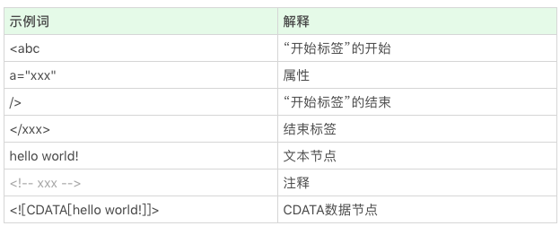
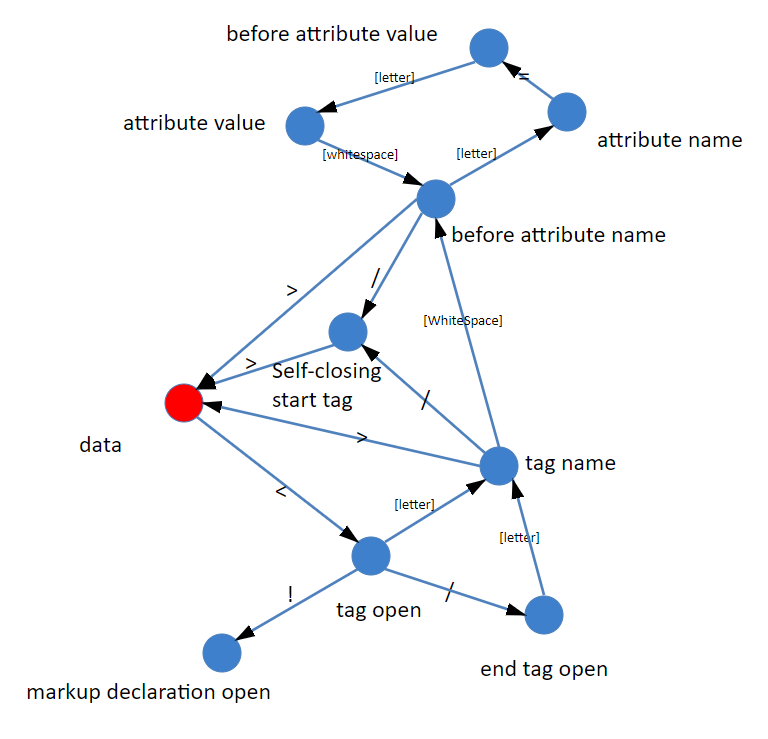

# 浏览器：浏览器是如何工作的？(阶段二)

上一章最开始大概介绍了浏览器工作的6个阶段，而上一章对第一个部分通讯阶段进行了学习，也就是浏览器使用 HTTP 协议或者 HTTPS 协议，向服务端请求页面的整个过程；而这一章即阶段二主要从两个过程来学习：一是如何解析请求回来的 HTML 代码；而是 DOM 树是如何构建的。  
  
## 解析代码

在上一章学习了 HTTP 的构成，但是在 Response 的 body 部分并没有具体的学习，这一章就会对 Response 的 body 部分进行学习处理； HTML 的结构不算太复杂，日常开发中需要的 90% 的“词”(词指编译原理的术语 token，表示最小的有意义的单元)，种类大约只有标签开始、属性、标签结束、注释、CDATA节点几种。  
  
实际上麻烦的是，由于 HTML 跟 [SGML](https://wiki.mbalib.com/wiki/SGML) 的千丝万缕的联系，我们需要做不少的兼容处理；像“<?”和“<%”什么的也是必须要支持好的，报错了必须给出回应。  
  
1. 词(token)是如何被拆分的  
首先看一个标准的标签会被如何拆分：

``` javascript
<p class="a">text brand</p>
```

如果从最小有意义的定义来拆分，第一个词(token)是什么？显然，作为一个词(token)，整个 p 标签肯定是过大(因为标签还可以嵌套其它标签内容)。  
  
那么，只用 p 标签的开头是不是合适？因为在起始标签也是会包含属性的，那么最小的意义单元其实是 “<p”，所以 “<p” 就是我们的第一个词 (token)。  
  
继续拆分，可以吧这段代码依次拆成词(token)：

- <p “标签开始”的开始
- class="a" 属性
- > “标签开始”的结束
- text brand 文本
- </p> 标签结束

这就是这个例子的最小有意义单元拆分，那这些全部的词(token)长成什么样子：  
  
  
根据这里的分析可以设想，代码开始从 HTTP 协议收到的字符流读取字符，在接收第一个字符之前，我们无法判断这是哪一个词(token)，不过，随着接收的字符越来越多，拼出其他的内容的可能性就越来越小；比如，假设我们接收了一个字符“<”，我们一下就知道这不是文本节点，之后再继续读字符，比如是 x，那么这就知道了它不是注释和 CDATA 了，接下来继续读，直到遇到 “>”或者空格，这样就得到了一个完整的词(token)。  
  
实际上，每读入一个字符就需要做一次决策，而且这些决定是跟“当前状态”有关的，在这样的条件下，浏览器工程师要想实现把字符解析成词(token)，最常见的方案就是使用状态机。  

2. 状态机
绝大多数语言的词法部分都是用状态机实现的，这里把部分词(token)的解析化成一个状态机：  
  
  
这里借鉴winter老师给出的状态机图，他说整整的 HTML 词法状态机更复杂，详细内容看 [HTML官方文档](https://html.spec.whatwg.org/multipage/parsing.html#tokenization)，HTML 官方文档规定了80个状态。