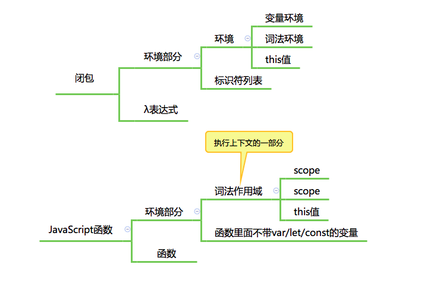

# JavaScript执行环境(2)，闭包和执行上下文到底是怎么回事？

在上一节了解了 JavaScript 执行中最粗粒度的任务：传给引擎执行的代码段。并且，我们还根据“由 JavaScript 引擎发起” 还是“由宿主发起”，分成了宏观任务和微观任务，接下来继续学习更细的执行粒度。  
  
- 闭包
- 作用域链
- 执行上下文
- this 值

实际上，尽管这里的几个词语表示了不同的术语，但他们所指向的几乎是同一部分知识，那就是函数执行过程相关的内容；看下图(来自winter老师 )：
  
这里除了要理解函数执行过程的知识，对理清这些知识的概念也非常重要；所以先来看看有点儿复杂的概念：闭包。

## 闭包

闭包翻译自英文单词 closure，这个词在计算机领域，它就有三个完全不同的意义：编译原理中，它是处理语法产生的一个步骤；计算几何中，它表示包裹平面点集的凸多边形；而在编程语言领域，它表示一种函数。  
  
从简单角度理解，闭包其实就是一个绑定了执行环境的函数，这个函数并不是印在书里的一条简单的表达式，闭包与普通函数的区别是，它携带了执行的环境，就像人在外星中需要自带吸氧设备一样，这个函数也带有在程序中生存的环境。  
  
这个古典的闭包定义中，闭包包含了两个部分：

- 环境部分
  - 环境
  - 标识符列表
- 表达式部分

当我们把视角放在 JavaScript 的标准中，我们发现，标准中并没有出现过 closure 这个术语，但是，我们却不难根据古典定义，在 JavaScript 中找到对应的闭包组成部分。  
