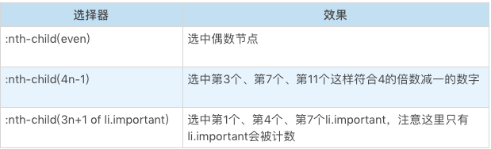

# CSS选择器：如何选中svg里的a元素？

在之前 CSS 语法学习篇章中，学习了选择器的一部分基础知识，这里再进行更进一步的学习；在前面的 CSS 语法学习篇章中也了解了一些选择器，但在进入到具体的选择器介绍之前，首先要对选择器有一个整体的认识。  
  
先说说选择器是什么，选择器是由 CSS 最先引入的一个机制(但随着document.querySelector等API的加入，选择器已经不仅仅是CSS的一部分了)。  
  
**选择器的基本意义是：根据一些特征，选中元素树上的一批元素**。  
  
从选择器的结构来分，从简单到复杂可以分成以下几种：

- 简单选择器：针对某一特征判断是否选中元素
- 复合选择器：连续写在一起的简单选择器，针对元素自身特征选择单个元素
- 复杂选择器：由“空格” “>” “~” “+” “||” 等符号链接的复合选择器，根据父元素或者前序元素检查单个元素
- 选择器列表：由逗号分隔的复杂选择器，表示“或”的关系

## 简单选择器

简单选择器是针对某一特征判断是否为选中元素，这里对一系列常见的简单选择器进行统一记忆：  
  

## 类型选择器和全体选择器

首先介绍第一个简单选择器：类型选择器，它根据一个元素的标签名来选中元素。

``` javascript
div {

}
```

这里其实非常简单，但是真的就是这么简单吗？实际上，这里要考虑 html 或者 xml 元素的命名空间问题。  
比如我们的 svg 元素，在实际的 [svg](https://www.w3.org/2000/svg) 命名空间之下，svg 和 html 中都有 a 元素，若想要区分选择 svg 中的 a 和 html 中的 a，就必须用带命名空间的类型选择器。

``` javascript
<!DOCTYPE html>
<html>
<head>
  <meta charset="utf-8">
  <title>JS Bin</title>
</head>
<body>
<svg width="100" height="28" viewBox="0 0 100 28" version="1.1"
     xmlns="http://www.w3.org/2000/svg" xmlns:xlink="http://www.w3.org/1999/xlink">
  <desc>Example link01 - a link on an ellipse
  </desc>
  <a xlink:href="http://www.w3.org">
    <text y="100%">name</text>
  </a>
</svg>
<br/>
<a href="javascript:void 0;">name</a>
</body>
</html>

@namespace svg url(http://www.w3.org/2000/svg);
@namespace html url(http://www.w3.org/1999/xhtml);
svg|a {
  stroke:blue;
  stroke-width:1;
}

html|a {
  font-size:40px
}
```

另外一个选择器是**全体选择器(*)**，可以选中任意元素，它的用法跟类型选择器是完全一致的，即如上。  

## id选择器与class选择器

id选择器和class选择器都是针对特定属性的选择器。id选择器是“#”号后面跟随id名，class选择器是“.”号后面跟随class名，如下：

``` javascript
#idName {
  color: #eee;
}
.className {
  color: #aaa;
}
```

这两个选择器都是在属性选择器之前就设计出来的选择器，当属性选择器出来了之后，理论上可以一定程度上替代它们；但是，class 选择器识别的是：用空格分隔的 class 语法。

``` javascript
html
<a class="cA cB cD">标签的内容</a>

css
.cA {
  color: #f00;
}
```

这个例子中，使用了空格分隔的 class 属性，使用 “.cA”、“.cB”和“.cD”都能够选中元素，也可以使用多个 class 选择器来要求元素具有多个类。

## 属性选择器

属性选择器根据 html 元素的属性来选中元素，属性选择器有四种状态：

1. [attr]

直接在方括号中放入属性名，是检查元素是否具有这个属性，只要元素有这个属性，不论属性是什么值，都可以被选中。

2. [attr=val]

精确匹配，检查一个元素属性的值是否是 val。

3. [attr~=val]

多种匹配，检查一个元素的值是否是若干值之一，这里的 val 不是一个单一的值了，可以是用空格分隔的一个序列。

4. [attr|=val]

开头匹配，检查一个元素的值是否是以val开头，它跟精确匹配的区别是属性只要以val开头即可，后面内容不用管。
  
有些 html 属性含有特殊字符，这个时候可以把 val 用引号括起来，形成一个css字符串，css字符串允许使用单双引号来规避特殊字符，也可以用反斜杠转义，这样，就可以表示出任意属性值。

## 伪类选择器

伪类选择器是一系列由 css 规定好的选择器，它们以冒号开头，而伪类选择器有普通型和函数型两种。  
首先来看一下伪类中最常用的部分：树结构关系伪类

**树结构关系伪类选择器**  
:root伪类表示树的根元素，在选择器是针对完整的 html 文档情况，我们一般用 html 标签即可选中根元素；但是随着 scoped css 和 shadow root 等场景出现，选择器可以针对某一子树来选择，这时候就很需要 root 伪类了。  

- :empty 伪类表示没有子节点的元素，这里有个例外就是子节点为空白文本节点的情况
- :nth-child 和 :nth-last-child 这是两个函数型的伪类， css 的 An+B 语法设计的是比较复杂的，我们这里仅仅介绍基本用法，如下几个例子：  
  

- :nth-last-child 的区别仅仅是从后往前数
- :first-child :last-child 分别表示第一个和最后一个元素
- :only-child 按字面意思理解即可，选中唯一一个子元素

of-type 系列，是一个变形的语法糖，S:nth-of-type(An+B) 是 :nth-child(|An+B|of S) 的另一种写法。  
以此类推，还有 nth-last-of-type、first-of-type、last-of-type、only-of-type。

## 链接与行为伪类选择器

链接与行为是第一批设计出来的伪类，也是最常用的一批。  

- :any-link 表示任意的链接，包括 a、area 和 link 标签都可能匹配到这个伪类
- :link 表示未访问过的链接，:visited 表示已经访问过的链接
- :hover 表示鼠标悬停在上的元素
- :active 表示用户正在激活这个元素，如用户按下按钮，鼠标还未抬起时，这个按钮就处于激活状态
- :focus 表示焦点落在这个元素之上
- :target 用于选中浏览器 URL 的 hash 部分所指示的元素

在 Selector Level 4 草案中，还引入了 target-widthin、 focus-within 等伪类，用于表示 target 或者 focus 的父容器。

## 逻辑伪类选择器

逻辑伪类 —— :not 伪类。  
这个伪类是个函数型伪类，它的作用是选中内部的简单选择器命中的元素。  

``` javascript
*|*:not(:hover)
```

选择器3级标准中，not 只支持简单选择器，在选择器 4 级标准中，则允许 not 接收一个选择器列表，这意味着选器支持嵌套，仅靠 not 即可完成选择器的一阶真值逻辑玩呗，但目前浏览器没支持。  

## 其他伪类选择器

还有一些草案中或者不常用的选择器，了解一下。  

- 国际化：用于处理国际化和多语言问题
  - dir
  - lang
- 音频、视频：用于区分音视频播放状态
  - paly
  - pause
- 时序：用于配合读屏软件等时序性客户端的伪类
  - current
  - past
  - future
- 表格：用于处理 table 的列的伪类
  - nth-col
  - nth-last-col

伪类是很大的一类简单选择器，它是选择器能力的一种补充，在实际使用中，尽量使用合适的 id 和 class 来标识元素，约束伪类的使用。

## 结语

这里从 css 选择器的整体结构来学习了简单选择器，包括：

- 类型选择器
- 全体选择器
- id 选择器
- class 选择器
- 伪类选择器