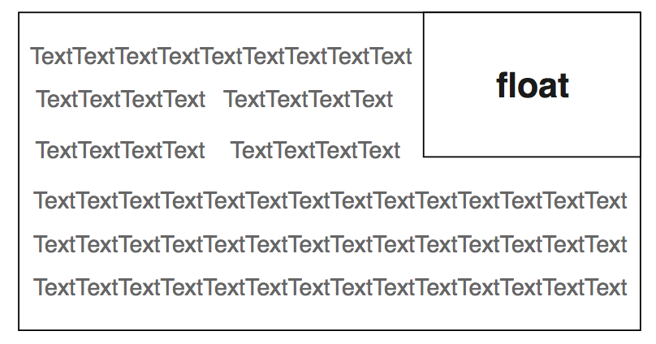

# CSS 排版：CSS 的正常流

css 是平时开发过程中必须使用的技术，那么，它的排版部分学习的怎么样？因为在前期css设计上不能够很好的支持在浏览器中的排版要求，需要开发者使用很多黑科技来进行处理，这就导致部分新人在接触的时候直接停止学习。  
而现在css提供了很多种的排版方式，在开发时也有很多选项可以选择合适自己的哪一种；然而，正常流却是开发者始终绕不过的一种排版话题。在网上能够找到很多关于正常流的话题，如：块级格式化上下文、margin 折叠等，这一系列内容听起来就很头痛。所以，又有很多人觉得很奇怪，正常流到底正常在哪里；事实上，我认为正常流是简单和符合直觉的东西；那么什么是正常流？  

## 正常流的行为

首先，对排版这个词做一个理解；在毕昇发明活字印刷之前，排版这项工作是不存在的，那时候人们想要印刷书籍就需要雕版工人去人工雕刻印版。  
活字印刷的出现，引入了排版的概念，排版是活字印刷的众多工序之一，而排版的过程是由工人一个字一个字从字架检出，再排入版框中，实际上，这个过程就是一个流式的处理过程。  
从古代的活字印刷，到现代的出版行业，再到今天的web，排版过程其实并没有什么本质的变化，只不过，今天在我们的css中，排版需要处理的内容不再是简单的大小相同的木字或者铅字，而是有着不同字体和字号的富文本，以及插入在富文本中的大小不等的盒子。  
并且，在这些过程中都会有一个正常流的存在，那么什么是正常流呢？  
**正常流的排版行为就是：依次排列，排不了就换行**。这个操作很简单，就算不懂排版的人也能够这样理解。  
理解了正常流的基本概念，在正常流的基础上，我们还有float相关规则，使得一些盒占据了正常流的空间，则我们可以把float理解为“文字环绕”。  
  
我们还有vertical-align相关规则规定了如何在垂直方向对齐盒，vertical-align相关规则看起来复杂，但是实际上，基线、文字顶/底、行顶/底都是我们正常书写文字时需要用到的概念，只是平时不一定会总结。  
下图展示了在不同的vertical-align设置时，盒与文字是如何混合排版的：  
  
除此之外，**margin 折叠**应该怎么理解呢？实际上我们可以把**margin 折叠**理解为“一个元素规定了自身周围至少需要的空间”，这样，就比较容易理解为什么margin需要折叠。

## 正常流的原理