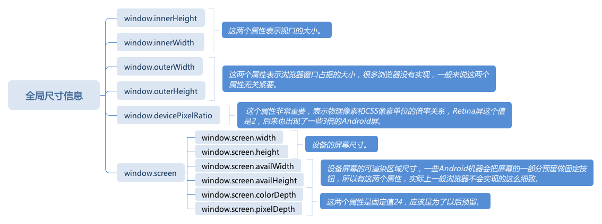

# 浏览器 CSSOM：如何获取一个元素的准确位置

首先，来个问题，通过对浏览器 API 的学习，是不是也有这样的 API，“element.width,element.height” 直接获取元素的宽高啊？

在学习 DOM 相关 API 的时候对 DOM API 包含 DOM 树形结构相关的内容有了一定的了解，那么今天这里接触到的是一类新的 API: CSSOM。  
刚接触到浏览器 API 的时候，获取元素的宽高总是要费很大功夫，并没有像 “elemen.width 和 element.height” 这样复合直觉设计的 API；但随着深入的学习，发现它们没有这样设计也有其背后的逻辑，正如 HTML 和 CSS 分别承担了语义和表现的分工，DOM 和 CSSOM 也有语义和表现的分工。  
DOM 中的所有属性都是用来表现语义的属性，CSSOM 的则都是表现的属性，width 和 height 这类显示相关的属性，都属于今天要学习的 CSSOM。  
顾名思义，CSSOM 是 CSS 的对象模型，在 W3C 标准中，它包含两个部分：描述样式表和规则等 CSS 的模型部分(CSSOM)，和跟元素视图相关的 view 部分(CSSOM View)。  
但是在实际使用中，CSSOM View 比 CSSOM 更常用一些，因为在工作中很少需要用代码动态的管理样式表。  

## CSSOM

首先学习一下 CSS 中的样式表的模型，也就是 CSSOM 的本体。  
通常创建样式表也都是使用 HTML 标签来做到的，我们用 style 标签和 link 标签创建样式表，例如：

``` javascript
<style>
h1 {
  color: #f00;
}
</style>

<link rel="stylesheet" href="http://*****" >
```

我们创建好样式表后，还有可能要对它进行一些操作，如果我们以 DOM 的角度去理解的话，这些标签在 DOM 中是一个节点，它们有节点的内容、属性，这两个标签中，CSS 代码有的在属性、有的在子节点；而这两个标签也遵循 DOM 节点的操作规则，所以可以使用 DOM API 去访问。但是，这样做的后果就是需要去写很多的分支逻辑，要想解析 CSS 代码结构也不是一件容易的事，所以，我们直接使用 CSSOM API 去操作它们生成的样式表是一个更好的选择。  
首先，CSSOM API 的基本用法，获取文档中所有的样式表：

``` javascript
document.styleSheets
```

document 的 styleSheets 属性表示文档中的所有样式表，它是只读的一个列表，这里我们可以用方括号运算符下标访问样式表，也可以使用 item 方法来访问，它有 length 属性表示文档中的样式表数量。样式表只能使用 style 标签或者 link 标签创建，虽然无法用 CSSOM API 来创建样式表，但是我们可以修改样式表中的内容：

``` javascript
document.styleSheet[0].insertRule("p {color:pink;}", 0);
document.styleSheet[0].removeRule(0);
```

更进一步，我们可以获取样式表中特定的规则，并且对它进行一定的操作，具体来说，就是使用它的 cssRules 属性来实现：

``` javascript
document.styleSheets[0].cssRules
```

这里获取到的规则列表，同样是支持 item、length 和下标运算；不过，这里的 Rules 可能就不会那么简单，它可能是 CSS 的 at-rule，也可能是普通的样式规则；不同的 rule 类型，具有不同的属性。而在之前的 CSS 语法部分，整理过 at-rule 的完整列表，多数 at-rule 都对应着一个 rule 类型：

- CSSStyleRule
- CSSCharsetRule
- CSSImportRule
- CSSMediaRule
- CSSFontFaceRule
- CSSPageRule
- CSSNamespaceRule
- CSSKeyframesRule
- CSSKeyframeRule
- CSSSupportsRule

而 CSSStyleRule 有两个属性：selectorText 和 style，分表表示一个规则的选择器部分和样式部分。selector 部分是一个字符串，style 部分是一个样式表，它跟我们元素的 style 属性是一样的类型，所以我们可以像修改内联样式一样，直接改变属性修改规则中的具体 CSS 属性定义，也可以使用 cssText 这样的工具属性。  
此外，CSSOM 还提供了一个非常重要的方法来获取一个元素最终经过 CSS 计算得到的属性：

``` javascript
window.getComputedStyle(element, pseudoElement);
```

其中第一个参数是要获取属性的元素，第二个参数可选，用于选择伪元素。  

## CSSOM View

CSSOM View 这一部分的 API，可以视为 DOM API 的扩展，他在原本的 Element 接口上添加了显示相关的功能，这些功能，又可以分成三个部分：窗口部分、滚动部分和布局部分。  

1. 窗口 API
窗口 API 用于操作浏览器窗口的位置、尺寸等。

- moveTo(x, y) 窗口移动到屏幕的特定坐标
- moveBy(x, y) 窗口移动特定距离
- resizeTo(x, y) 改变窗口大小到特定尺寸
- resizeBy(x, y) 改变窗口大小特定尺寸

此外，窗口 API 还规定了 window.open() 的第三个参数：

``` javascript
window.open("about:blank", "_blank", "width=100,height=100,left=100,right=100");
```

而 window.open 在一些浏览器中处于安全性的考虑而没有实现，也不适用于移动端浏览器。

2. 滚动 API
要理解滚动，需要知道在 PC 时代，浏览器可视区域的滚动和内部元素的滚动关系是比较模糊的，但是在移动端越来越重要的今天，两者必须分开，它们的性能和行为都有区别。

3. 视口滚动 API
可视区域(视口)滚动行为由 window 对象上的一组 API 控制，如下：

- scrollX 是视口的属性，表示 X 方向上的当前滚动距离，有别名 pageXOffset
- scrollY 是视口的属性，表示 Y 方向上的当前滚动距离，有别名 pageYOffset
- scroll(x, y) 使得页面滚动到特定的位置，有别名 scrollTo，支持传入配置型参数 {top, left}
- scrollBy(x, y) 使得页面滚动特定的距离，支持传入配置型参数 {top, left}

通过这些属性和方法，我们可以读取视口的滚动位置和操作视口滚动。但是可以通过在 document 对象上绑定事件监听函数，如下：

``` javascript
document.addEventListener("scroll", function(event) {
  // todo
});
```

视口滚动 API 是页面的顶层容器的滚动，大部分移动端浏览器都会采用一些性能优化，它和元素滚动不完全一样。

4. 元素滚动 API
元素滚动 API，在 Element 类中为了支持滚动加入了一下 API：

- scrollTop 属性，表示 Y 方向上的当前滚动距离
- scrollLeft 属性，表示 X 方向上的当前滚动距离
- scrollWidth 属性，表示元素内部的滚动内容的宽度，一般来说大于等于元素宽度
- scrollHeight 属性，表示元素内部的滚动内容的高度，一般来说大于等于元素高度
- scroll(x, y) 使得元素滚动到特定的位置，有别名 scrollTo，支持传入参数 {top, left}
- scrollBy(x, y) 使得元素滚动到特定的位置，支持传入配置型参数 {top, left}
- scrollIntoView(arg) 滚动元素所在的父元素，是的元素滚动到可见区域，可以通过 arg 来指定滚到中间、开始或者就近

除此之外，可滚动的元素也支持 scroll 事件，可以在元素上监听它：

``` javascript
element.addEventListener('scroll', function(event){
  // todo
})
```

5. 布局 API
布局 API 是整个 CSSOM 中最常用到的部分，它分成：全局 API 和元素上的 API。  

- 全局尺寸信息
window 对象上提供了一些全局的尺寸信息，它是通过属性来提供的，如下图：

  

  - window.innerHeight,window.innerWidth 这两个属性表示视口的大小
  - window.outerWidth,window.outerHeight 这两个属性表示浏览器窗口占据的大小
  - window.devicePixelRatio 表示物理像素和 CSS 像素单位的倍率关系
  - window.screen
    - window.screen.width,window.screen.height 设备的屏幕尺寸
    - window.screen.availWidth,window.screen.availHeight 设备屏幕的可渲染区域尺寸
    - window.screen.colorDepth,window.screen.pixelDepth 这两个属性是固定值 2 4

- 元素的布局信息
最后，回到前面一开始提到的问题，是否能够取到一个元素的宽(width)和高(height)？  
实际上，首先应该消除“元素有宽高”的这个概念，在这里的学习过程中已经多次了解到，有些元素可能产生多个和，事实上，只是＆有宽和高，元素是没有的。  
所以，我们获取的宽高的对象应该是“盒”，于是 CSSOM View 为 Element 类添加了两个方法：

  - getClientRects()
  - getBoundingClientRect()

getClientRects() 返回一个列表，里面包含元素对应的每一个盒所占据的客户端矩形区域，这里每个矩形区域可以用 x,y,width,height 来获取它的位置和尺寸；  
getBoundingClientRect() 返回元素对应的所有盒的包裹的矩形区域，这个 API 获取的区域会包括当 overflow 为 visible 时的子元素区域。  
这两个 API 获取的矩形区域都是相对于视口的坐标，这意味着，这些区域都是受滚动影响的，如下一个获取相对坐标的例子：

``` javascript
var offsetX = document.getBoundingClientRect().x - element.getBoundingClientRect().x
```

这里就是讲文档根节点的位置减去当前元素的位置就得到了一个相对坐标。

## 总结

最后这里通过学习 CSSOM 这一类 API，就像 HTML 和 CSS 分表承担了语义和表现的分工，DOM 和 CSSOM 也有语义和表现的分工。  
CSSOM 是 CSS 的对象模型，在 W3C 标准中，它包含两个部分：描述样式表和规则等 CSS 的模型部分 (CSSOM)，和根元素视图相关的 View 部分 (CSSOM View)。  

好多东西。。。需要加深理解。额