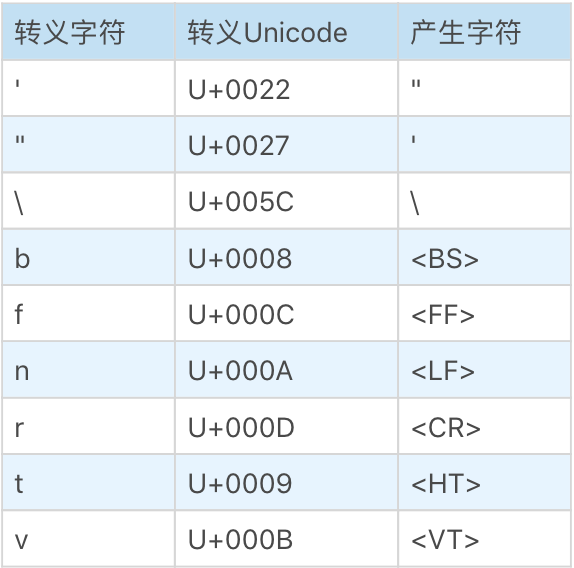

# JavaScript词法：为什么10.toString()会报错

文法是编译原理中对语言的写法的一种规定，一般来说，文法分成词法和语法两种。  
词法规定了语言的最小语义单元：token；从字符到词的整个过程是没有结构的，只要符合词的规则，就构成词。

## 概述

先学习一下 JavaScript 词法的定义，JavaScript 的输入可以分为：

- WhiteSpace 空白字符
- LineTerminator 换行符
- Comment 注释
- Token 词
  - IdentifierName 标识符名称(如变量名、关键词等)
  - Punctuator 符号，如使用的运算符或大括号等
  - NumericLiteral 数字直接量，如数字
  - StringLiteral 字符串直接量，如单引号或双引号包起来的直接量
  - Template 字符串模板，如反引号`括起来的直接量

这样的设计符合比较通用的编程语言设计方式，不过，JavaScript中有一些不一样的地方；首先，除法和正则表达式冲突问题，大家都知道，在JavaScript中不但支持除法运算符 `/` 和 `/=` 这种形式，还支持用斜杠括起来的正则表达式 `/abc/`；但是，这时候对词法分析来说，它是没有办法处理的，所以 JavaScript 解决方案是定义两组词法，然后靠语法分析传一个标志给词法分析器，最终决定使用哪个方案；JavaScript 词法的另外一个特别设计是字符串模板，模板语法大概是这样：

``` javascript
`this is ${fruitName}`
```

理论上讲，`${}` 内部可以放任何 JavaScript 表达式代码，而这些代码是以 `}` 结尾的，也就是说，这部分词法不允许出现 `}` 运算符；而是否允许 `}` 的两种情况，与除法和正则表达式的两种情况相乘就是四种词法定义，所以在 JavaScript 标准中可以看到四种定义：

- InputElementDiv
- InputElementRegExp
- InputElementExpOrTemplateTail
- InputElementTemplateTail

为了解决这两个问题，标准中还把除法、正则表达式直接量和`}`从 token 中单独抽出来，用词上也把原本的 token 改为了 commonToken。对于一般的语言的词法分析过程来说，都会丢弃除 token 之外的输入，但是在 JavaScript 中不太一样，换行符和注释都会影响语法分析过程。

## 空白字符 WhiteSpace

空白字符，首先想到的肯定是空格，但是在 JavaScript 中，它可以支持更多的空白符号。如下：

- \<HT\>(或称呼 \<TAB\>) 是 U+0009，是缩进 tab 符，也就是字符串中写的 \t
- \<VT\> 是 U+000B，它是垂直方向上的 tab 符 \v，在键盘上都不知道怎么打，所有一般很少用到
- \<FF\> 是 U+000C，它是 Form Feed 分页符，字符串直接量是 \f
- \<SP\> 是 U+0020，它就是最普通的空格
- \<NBSP\> 是 U+00A0，它是非断行空格，它是 SP 的变体，在文字排版中，可以避免因为空格而发生的断行，其它方面和空格一样，当然多数的 JavaScript 编辑器会把它当做一个普通的空格，在 HTML 中经常用到的 &nbsp; 最后生成的就是它
- \<ZWNBSP\>(旧称 \<BOM\>) 是 U+FEFF，它是 ES5 中新加入的空格，是 Unicode 中的零宽非断行空格，在以 UTF 格式编码的文件中，常常在文件首插入一个额外的 U+FEFF，解析 UTF 文件的程序可以根据 U+FEFF 的表示方法猜测文件采用哪种 UTF 编码方式，这个字符也叫做 “bit order mark”

此外，JavaScript 支持所有的 Unicode 中的空格，如下图：
  

然而一般的编码规范要求 JavaScript 源代码控制在 ASCII 范围内，那么就只有 \<TAB\>、\<VT\>、\<FF\>、\<SP\>、\<NBSP\> 这几种空格可以使用。

## 换行符 LineTerminator

下面学一下换行符，JavaScript 中提供了 4 中换行符号：

- \<LF\>
- \<CR\>
- \<LS\>
- \<PS\>

其中，\<LF\> 是 U+000A，就是正常的换行符，在字符中用 \n 表示。  
\<CR\> 是 U+000D，它是真正意义上的回车，在字符中是 \r 表示，在一部分的 Windows 编辑器风格中，换行符是两个字符 \r\n 的组合。  
\<LS\> 是 U+2028，是 Unicode 中的行分隔符。  
\<PS\> 是 U+2029，是 Unicode 中的段落分隔符。  
  
大部分的 LinerTerminator 在被词法解析器扫描出来后会被丢弃，但是换行符会影响 JavaScript 中两个重要的特性：自动插入分号和 “no line terminator” 规则。

## 注释 comment

JavaScript 的注释分为单行和多行注释：

``` javascript
/* MultiLineNotAsteriskChar */
// SingleLineCommentChars
```

多行注释中允许出现多行的 MultiLineNotAsteriskChar，而单行的注释只对当前行有用。

## 标识符名称 IdentifierName

IdentifierName 可以以美元 $ 符、下划线 _ 或者 Unicode 字母开始，除了开始字符以外，IdentifierName 还可以使用 Unicode 中的连接标记、数字以及连接符号。  
IdentifierName 的任意字符可以使用 JavaScript 的 Unicode 转义写法，使用 Unicode 转义写法时没有任何字符限制。  

## 数字直接量 NumericLiteral

而本文的题目中的问题到了该解决的时候了，JavaScript 规范中规定的数字直接量有四种写法：十进制、二进制、八进制、十六进制。  
这几种进制都很简单，十进制的 Number 不仅可以是整数，还可以是带小数点的小数且小数点前面的数字是可以省略的；最后我们看一下这个问题 12.toString() 为什么会报错。  

``` javascript
12.toString();
```

这时候 12. 会被当做省略了小数点后面的内容的数字而看成一个整体，所以我们要想让点单独称为一个 token，就要加入空格，如下：

``` javascript
12 .toString();
```

即，这样的话数字和小数点号就进行了拆分，. 号就成了单独的 token，而 12 .toString() 也不会报错了。

## 字符串直接量 StringLiteral

字符串可以用单引号和双引号两种写法表示:

``` javascript
"DoubleStringCharacters"
'SingleStringCharaters'
```

两者仅仅是写法的不同而已，而在双引号的字符串直接量中的双引号必须进行转义，而单引号的字符串直接量中单引号也必须进行转义，即一个反斜杠 \ 后面跟一个字符的形式。  
那么这种又特殊意义的字符包括有如下几种：
  

## 正则表达式直接量 RegularExpressionLiteral

正则表达式由 body 和 flags 两部分组成：

``` javascript
/RegularExpressionBody/g
```

body 部分其中至少有一个字符，第一个字符不能是 *，/* 和多行注释冲突，其它的知识点很多，另外学习。

## 字符串模板 Template

字符串模板是一个新的语法，从语法结构上将，Template 是一个整体，其中的 ${} 是并列关系；但是实际上在 JavaScript 词法中，包含 ${} 的 Template 是被拆开分析的；如下：

``` javascript
`a${b}c${d}e`
```

它在 JavaScript 中被认为是：

``` javascript
`a${
b
}c${
d
}e`
```

它被拆分成了5部分：

- `a${ 称为模板头
- }c${ 称为模板中段
- }e`  称为模板尾
- b d  称为普通标识符

但是，我们在学习的时候大可不必这样理解，可以认为模板就是一个由反括号括起来的可以在中间插入代码的字符串。

## 总结

最后这里对 JavaScript 的空白符号、换行符、注释符、标识符、数字直接量、字符串直接量、正则表达式直接量、字符串模板的词法进行了学习。并且通过对数字直接量的过程处理达到了解决题目提出的问题。