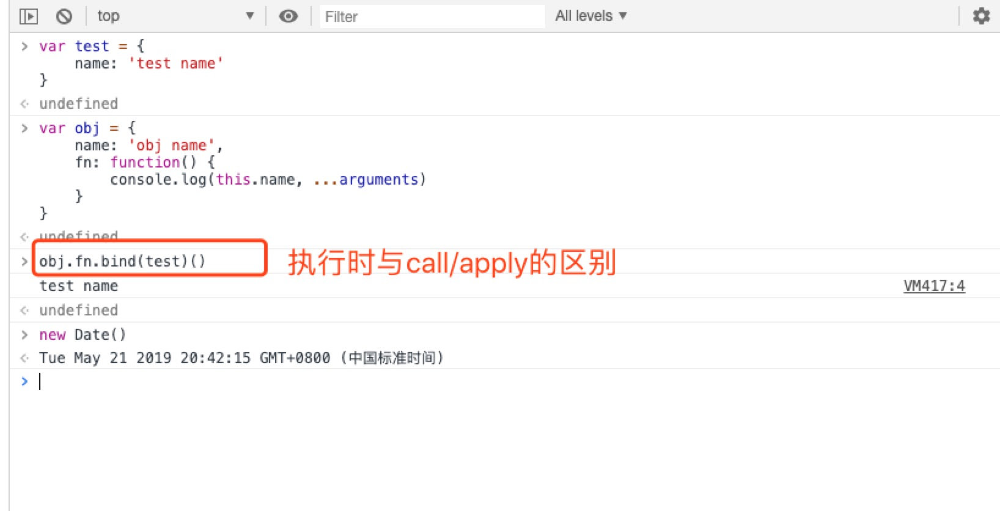
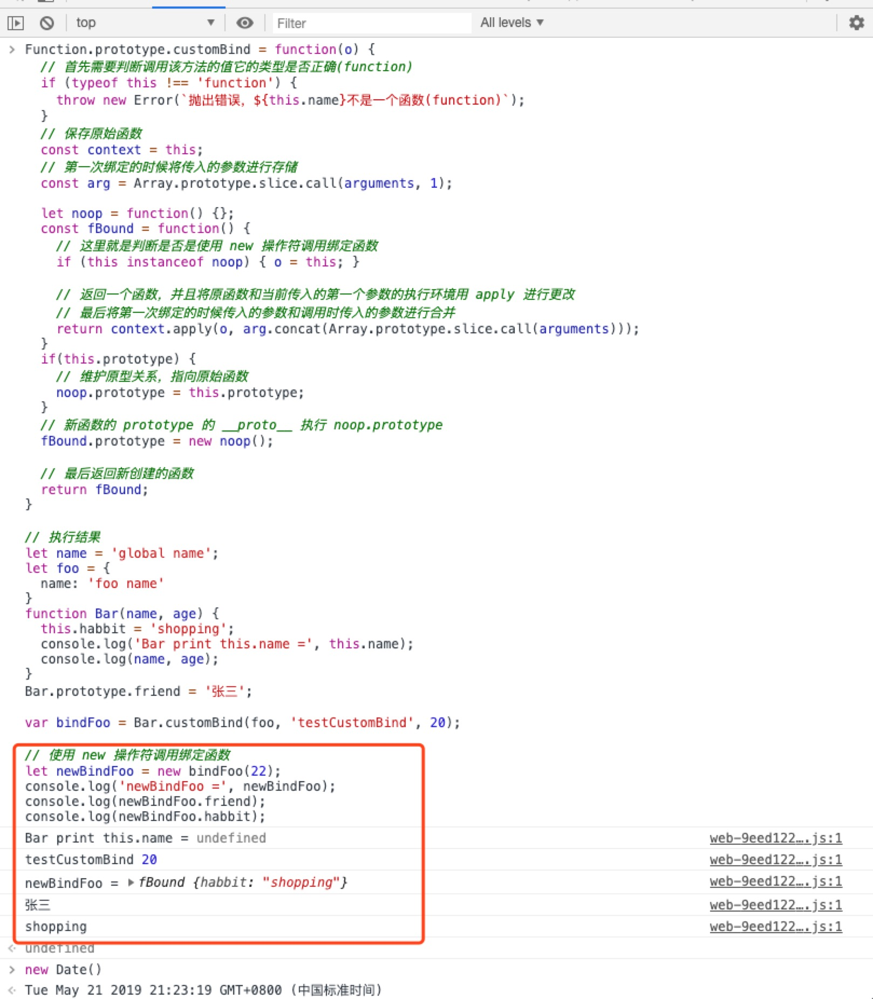

# apply, bind 方法原生实现

前面一节学习内容对 call 方法进行了再次学习研究，从中又感悟出不少东西；但是很常见的就是 apply、bind 三个方法同时出现作比较，那么这里也会接着 call 之后把 apply、bind 的学习理解做一个记录。

## apply

apply 函数传入的是 this 的指向和参数数组，那么自己实现一个该方法怎么做？其实 apply 的实现和 call 很相似，唯一不同的地方就是方法传入的参数不太一样；既然这样，看如下实现的 apply 实例：

``` javascript
Function.prototype.customApply = function(o, arr) {
  let result;
  // 如果调用 customCall 没有传入参数时则绑定到 全局
  // 如果是像 string、number 这些值时转换成 object
  let context = (o === null || o === undefined) ? window || global : Object(o);

  // 存储一下调用该 customApply 的方法
  context._fn_ = this;

  if (!arr) {
    result = context._fn_();
  } else {
    // 处理传入的数组参数
    const args = [];
    for (let i = 0; i < arr.length; i++) {
      args.push(`arr[${i}]`);
    }
    result = eval(`context._fn_([${args.toString()}])`);
  }

  // 删除 this 的指向
  delete context._fn_;
  // 如果有返回值则返回，否则返回 undefined
  return result;
}

// 定义完绑定函数后，用一个实际示例看一下执行情况
const test = {
  name: 'test name'
}
const obj = {
  name: 'obj name',
  fn: function() {
    console.log(this.name, ...arguments);
  }
}

// 直接执行 obj 中的方法 fn
obj.fn(); // obj name
// 改变 obj.fn 执行时的上下文环境并传入参数
obj.fn.customApply(test, [1,2,3]); // test name [1,2,3]
// 通过上面两个调用方式的改变能看出打印出的数据的不同，并且已经实现了 bind 的绑定
```

这个实例我在浏览器环境中执行效果如图：
  

通过上面的实例完全可以看出它和 call 的实现大同小异，区别仅仅在处理函数，那么 apply 的实现就处理完了。

## bind

在 call、apply 都已经完成的情况下，那么 bind 也能够改变当前执行函数的执行上下文，那它又是怎么回事？我们该怎么处理呢？  
首先，了解一下 bind 和 call、apply 的不同之处，bind 也是函数的方法，作用也是改变 this 执行且也能传递多个参数，那么区别究竟是什么？答案就是它不会立即执行，返回的是一个改变上下文 this 指向后的函数，原函数并没有被改变。当使用 new 操作符调用绑定函数是，传入的第一个参数无效。  

直接看一下原生的 bind 方法执行，如下图：
  

既然对其概念和执行过程都了解后，自己模拟一个该方法。

``` javascript
Function.prototype.customBind = function(o) {
  // 首先需要判断调用该方法的值它的类型是否正确(function)
  if (typeof this !== 'function') {
    throw new Error(`抛出错误，${this.name}不是一个函数(function)`);
  }
  // 保存原始函数
  const context = this;
  // 第一次绑定的时候将传入的参数进行存储
  const arg = Array.prototype.slice.call(arguments, 1);

  return function() {
    // 返回一个函数，并且将原函数和当前传入的第一个参数的执行环境用 apply 进行更改
    // 最后将第一次绑定的时候传入的参数和调用时传入的参数进行合并
    context.apply(o, arg.concat(Array.prototype.slice.call(arguments)));
  }
}

// 完成到这里我们就能够对一个正常的数据进行执行上下文的改变了，调用一下
let test = {
  name: 'test name'
}
let obj = {
  name: 'obj name',
  fn: function() {
    console.log(this.name);
  }
}

obj.fn.customBind(test)(); // test name
```

在浏览器的执行结果如图：
  
**特殊情况就是在使用 new 操作符调用绑定函数时，传入的改变执行环境上下文的参数无效**，实现如下图：

``` javascript
Function.prototype.customBind = function(o) {
  // 首先需要判断调用该方法的值它的类型是否正确(function)
  if (typeof this !== 'function') {
    throw new Error(`抛出错误，${this.name}不是一个函数(function)`);
  }
  // 保存原始函数
  const context = this;
  // 第一次绑定的时候将传入的参数进行存储
  const arg = Array.prototype.slice.call(arguments, 1);

  let noop = function() {};
  const fBound = function() {
    // 这里就是判断是否是使用 new 操作符调用绑定函数
    if (this instanceof noop) { o = this; }

    // 返回一个函数，并且将原函数和当前传入的第一个参数的执行环境用 apply 进行更改
    // 最后将第一次绑定的时候传入的参数和调用时传入的参数进行合并
    return context.apply(o, arg.concat(Array.prototype.slice.call(arguments)));
  }
  if(this.prototype) {
    // 维护原型关系，指向原始函数
    noop.prototype = this.prototype;
  }
  // 新函数的 prototype 的 __proto__ 执行 noop.prototype
  fBound.prototype = new noop();

  // 最后返回新创建的函数
  return fBound;
}

// 执行结果
let name = 'global name';
let foo = {
  name: 'foo name'
}
function Bar(name, age) {
  this.habbit = 'shopping';
  console.log('Bar print this.name =', this.name);
  console.log(name, age);
}
Bar.prototype.friend = '张三';

var bindFoo = Bar.customBind(foo, 'testCustomBind', 20);
// 这里进行 正常绑定 直接执行绑定后的函数
bindFoo();
// Bar print this.name = foo name
// testCustomBind 20
```

在浏览器执行结果如图：
  

前面是正常执行绑定操作，那么使用 new 操作符调用绑定函数呢？

``` javascript
let newBindFoo = new bindFoo(22);
console.log('obj =', obj);
console.log(obj.friend);
console.log(obj.habbit);
// 执行结果
// Bar print this.name = undefined
// testCustomBind 20
// newBindFoo = fBound{habbit: 'shopping'}
// 张三
// shopping
```

这里 bind 返回的函数作为构造函数的时候，它绑定的 this 不会有任何作用，但是在绑定的时候传入的参数仍然有用。  
浏览器中的执行结果如下：
  

最后，在上面的所有流程走完之后，基本上对 call、apply、bind 的三个方法的学习也告一段落，其中的代码在手动实现的过程中又学习到了不少新内容。温故而知新呢…………