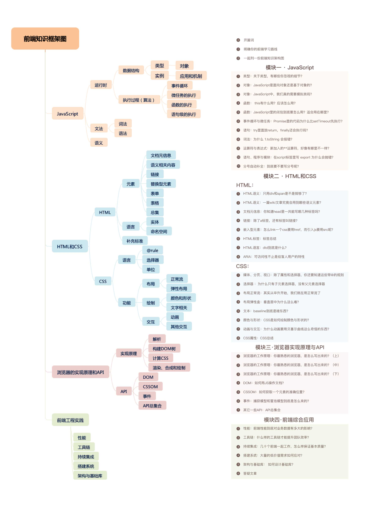

# 一份属于自己的知识架构

整理一份属于自己的知识架构不仅仅是将 MDN 这样的参考手册和一些其他的语言标准进行总结，而是知识架构有属于自己的特点，它的目标一个是把无法通过查阅解决的原理和背景讲清楚，另一个是把不方便查阅和记忆的内容进行整理。主要就是通过整理一份前端知识架构，再把知识做一个遍历，如果让我做一个划分，前端的知识在总体上分为基础部分和实践部分，基础部分包含了 JavaScript 部分(模块一)、CSS 和 HTML(模块二) 以及浏览器的实现原理和 API(模块三)，这几个模块基本上包含了前端需要掌握的所有知识；实践部分(模块四)的重点主要就是在工作中遇到的问题和解决方案。

## JavaScript

  
在 JavaScript 模块中，通过上面的图谱可以看出，我们可以把语言按照运行时、文法和语义来拆分，这符合语言的一般规律：**用一定词法和语法，表达一定语义，从而操作运行时。**  
接下来，又把运行时分为数据结构和算法部分：数据结构包含类型(7中基本类型)和实例；所谓算法，就是 JavaScript 的执行过程。  
类型部分中，对象比其他所有类型加起来都要复杂，所以后面这个部分是学习的重点，包括历史和思路都要掌握。  
实例部分，对 JavaScript 来说类似基础库，JavaScipt 的内置对象多达 150 以上，所以会从应用和机制的角度来进行，挑选部分进行学习。  
执行过程则需要按照从大结构到小结构的思路进行学习，从最顶层的程序与模块、事件循环和微任务，到函数，再到语句的执行。  

文法中的语法和语义基本是一一对应的关系，在 JavaScript 标准中有一份语法定义表，会从 JavaScript 语法中特别的地方来进行学习。而语义的大部分会跟随运行时的内容一起出现。  

## HTML 和 CSS

  
在上图中直接分成两个部分：HTML 部分和 CSS 部分  
**HTML 部分**，按照功能和语言来划分它的知识，HTML 的功能主要由标签来承担，所以会对标签元素进行分类学习，而基于分类，又会把标签分成下面几种：

- 文档元信心：通常是出现在 head 标签中的元素，包含了描述文档自身的一些信息
- 语义相关：扩展了纯文本，表达文章结构、不同语言要素的标签
- 链接：提供了文档内和文档外的链接
- 替换性标签：引入了声音、图片、视频等外部元素替换自身的一类标签
- 表单：用于填写和提交信息
- 表格：表头、表格、表尾等表格内容

**CSS 部分**，会从语言和功能两个角度进行学习，语言部分，会从大到小学习 CSS 的各种语法；而功能部分，大致分为布局、绘制和交互类。

## 浏览器的实现原理和 API

  
浏览器部分会学习浏览器的原理，它是理解 API 的基础，除此之外，会从浏览器设计出发，按照解析、构建DOM树、计算CSS、渲染、合成和绘制的流程来讲解浏览器的工作原理。  
在 API 部分，主要有：事件、DOM、CSSOM 几个部分，它们分别覆盖了交互、语义和可见效果。

## 前端工程实践

  
几个模块的最后一个是工程实践，此模块，通过性能、工具链、持续集成、搭建系统、架构与基础库这几个方向来进行。  
最后，有一个整体的框架图，梳理全部知识：
  
那么，就把这些知识转化成自己的真正内涵是需要时日的。。。。。
