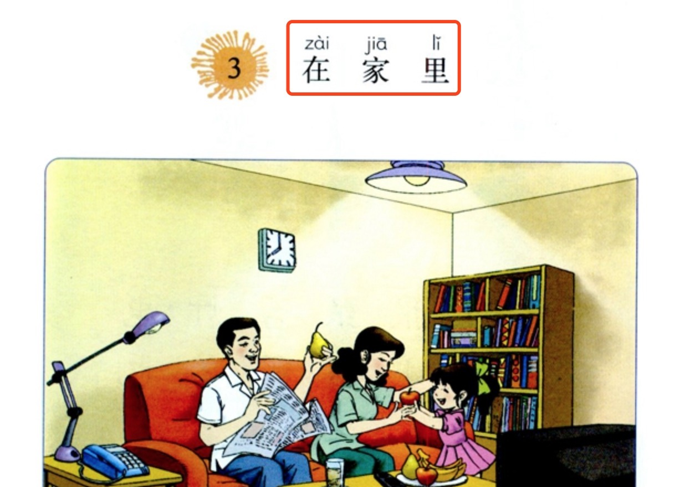

# HTML 语义，div 和 span 不是够用了吗

在前面的学习过程中，总体了解了语义是什么意思，那这里的学习主要是说说在 div 和 span 标签明显可以满足使用条件的情况下为什么还非要使用具有明确语义的标签来处理。

**语义类标签是什么，使用它的好处**  
语义类标签是前端工程师在工作中经常用到的一类标签，它们的特点是视觉表现上互相差不多，主要的区别在于它们表达了不同的语义，比如常见的 section、nav、p 标签等，这些都是语义标签。  
语义是我们说话表达的意思，多数的语义都是由文字来承载；而语义类标签则是纯文字的补充，比如标题，自然段，章节，列表等，这些内容仅仅纯文字是无法表达的，所以就需要用语义标签来代为表达。  
而我们在开发的工作中，经常都很少用到语义化的标签，而是直接用 div 和 span 全部搞定；那这样做到底行不行呢？毫无疑问，这样肯定是可以的。那这样做到底好不好呢？呵呵，套路说法就是不好，但是在很多情况下，答案其实是好。  
因为在互联网的产品里， HTML 用于描述 “软件界面” 的时间多过于 “富文本”，而软件界面里的东西基本上是没有语义化的，所以在这种软件界面的场景里面，直接用 div 和 span 这类标签时没有任何问题的。  
**不过，在很多场景里面语义化的标签又是无法替代的，正确的使用语义化的标签可以带来很多的好处**  

- 语义化的标签对开发者友好，使用语义化的标签增强了可读性，即使没有 CSS 的时候，开发者也能看清晰的看出页面的结构，便于团队开发维护。
- 除了对团队开发者友好之外，语义化标签也十分利于机器阅读，它的文字表现力丰富，更适合搜索引擎检索(SEO)，也能让搜索引擎爬虫更好的获取到信息，提升网页搜索量，并且语义类还可以支持读屏类软件，根据文章可以自动生成目录结构等。  

不过，不恰当的使用语义化标签反而会造成负面效果，比如无序列表 ul/li，经常就是很多开发者在看见像列表的位置就直接用了 ul/li，而它的正确使用是多数出现在行文中间，它的上文多数在提示，下面要出现列举的某些项，这种情况出现无序列表才比较好；如果没有正确的使用，其实会出现大量的冗余。  

所以，在使用语义化标签的时候，尽量做到**用对**，以免给浏览器这些机器带来不必要的处理。  

与 JavaScript 这样严格的编程语言相比，HTML 语义标签的使用更接近我们日常说话用的自然语。说话是没有唯一的标准措辞的，语义其实也一样，比如，下面有几种我认为比较重要的语义标签使用场景：

**作为自然语言延伸的语义类标签**  
这个意思就是，在这种情况下它作为自然语言和纯文本的补充，用来表达一定的结构和消除歧义；  
例如：**表达一定结构**的场景，在日语中，有一个语法现象叫做：ルビ，它的读音是 ruby（著名的 ruby 语言就是据此命名的），它中文的意思大约类似于注音或者意思的注解，在小学课本一年级在家里这一课的内容如下图：

图片中，在家里三个字都用拼音在上面进行了标注，这就是日文中 ruby 的用法，就形成了一个使用 ruby 的场景。  
在 HTML5 中，就引入了这个表示 ruby 的标签，它由 ruby、rt、rp 三个标签来实现；所以说，这些情况里存在的语义，其实原本就存在，直接用纯文字处理这种带标注的没办法表达，而 HTML 作为一种超文本标记语言，支持这些文字表达就是有必要的了。  
**还有一种情况，HTML 的部分标签实际上就是有必要的，其重要程度可以达到如果没有这个标签，文字就会产生歧义的程度**。下面用 `em` 标签做一个示例：
例句：

``` javascript
今天我吃了一个苹果
```

这句话现在没有做任何处理，也很简单，但是我们中文就是这么的博大精深，只要一句话在读的过程中重音位置不同，断句位置不同，那么它的意思就会产生变化；比如：

``` javascript
昨天我吃了两个苹果
今天我吃了一个苹果
```

当我们把前面的两句吃苹果语句中的数量词 `一个` 和 `两个` 用重音读的时候，就会发现这句话的意思好像变了，这时候，就到了 `html` 出来的时候了，如下：

``` javascript
昨天我吃了两个<em>苹果</em>
今天我吃了<em>一个</em>苹果
```

这里，用表强调的标签 `em` 对两句中的不同词进行了强调处理，那么这里的语义其实就已经变了，因此，只要理解了 `em` 的真正意思，这种语义标签在会产生歧义的部分就好处理了。

**作为标题摘要的语义类标签(文章的结构)**  
前面部分是关于自然语言的语义标签处理场景，这里要接触到的是另一个重要的场景 —— 文章的结构；当然，在 HTML 中也有这样的需求，语义化的 HTML 标签能够支持自动生成目录，而一篇文档会有一个树形的目录结构，它由各个级别的标签组成；例如：

``` javascript
<h1>文章标题</h1>
<p>标题介绍内容啦啦啦啦啦</p>
<h2>小标题</h2>
<p>小标题内容阿拉啦啦啦</p>
...
```

这里就出现了目录结构，其中 h1-h6 表达了文章中不同层级的标题，还有部分介绍内容；而有些时候我们的标题是需要一个副标题进行更进一步的介绍说明的，这种情况怎么办呢？为了避免副标题产生一个额外的层级，在 html 中有一个 hgroup 标签，例如：

``` javascript
<hgroup>
  <h1>文章标题</h1>
  <h2>副标题</h2>
</hgroup>
<p>小标题内容阿拉啦啦啦</p>
```

在 hgroup 标签中， h1-h6 只是被视为同一标题的不同组成部分；除了这种方法我们还有其他方法处理这个标题层级的问题吗？  
答案当然是有，从 `html5` 开始，出现了 `section` 标签，这个标签不仅仅是一个“有语义的 div”，它还会改变 h1-h6 的语义，section 嵌套会使得其内部的 h1-h6 下降一个层级，因此，在 html5 中我们只需要 section 和 h1 就能形成文档的树形结构，例如：

``` javascript
<section>
  <h1>文章标题</h1>
  <p>文章啦啦啦</p>
  <section>
    <h1>小一级标题</h1>
    <p>小一级标题啦啦啦</p>
  </section>
  <section>
    <h1>小一级标题</h1>
    <p>小一级标题啦啦啦</p>
  </section>
</section>
```

这样，就形成了一篇文章该有的目录结构。最后，我想说的是，在编写代码的过程中，语义化对开发者维护代码及机器的识别能够带来更好的效果；但是，语义化要写就要写对，如果写不对，还不如直接用 div 和 span 处理。

## 总结

开发过程中除了使用 div 和 span 标签以外还可以在适当的场景下使用 html5 提供的最新语义标签，但是要正确使用。  

### **学习 HTML5 中新增的所有标签**

- **html5语法**，html5 语法大部分延续了 html 语法，不同之处在于开头的:  

``` html
<!DOCTYPE html>
  <html lang="zh-CN">
  <meta charset="utf-8">
```

字符编码变得简洁、不区分大小写、添加了布尔值(类似checked、selected)、引号可以省略(不建议)、有可以省略结束符的标签(不建议)

- **增加标签**
  - 结构标签
    1. section
    2. article
    3. aside
    4. header
    5. hgroup
    6. footer
    7. nav
    8. figure
  - 表单标签
    1. email
    2. url
    3. number
    4. range
    5. Date Pickers
    6. search
    7. color
  - 媒体标签
    1. video
    2. audio
    3. embed
  - 其它功能标签
    1. mark
    2. progress
    3. time
    4. ruby、rt、rp
    5. wbr
    6. canvas
    7. command
    8. details
    9. datelist
    10. keygen

- **新增的属性**
  - 对于 js 进行添加的属性
    1. defer (`<script defer src="...js"></script>`)
    2. async (`<script async src="...js"></script>`)
  - 网页中标签加入小图标样式
    1. icon (`<link ref="icon" href="....url" type="pic name" size="16*16>"`)
  - manifest属性: 定义页面需要用到的离线应用文件
  - charset属性: meta属性之一，定义页面字符集
  - base属性: `<base href="http://localost/" target="_blank">`表示在新窗口打开一个页面时，将href中的内容作为前缀添加到地址前
  - media属性: `<a>`标签的属性，表示对何种设备进行优化
  - hreflang属性: `<a>`标签的属性，表示超链接指向的网址使用的语言
  - reversed属性: `<ol>`标签的属性，定义序号是否倒叙
  - start属性: `<ol>`标签的属性，定义序号的起始值
  - scoped属性: 内嵌css样式的属性，定义该样式只局限于拥有改内嵌样式的元素

html5中新增内容远不止于此。