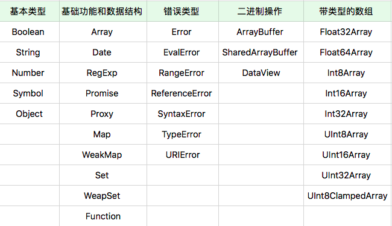

# JavaScript 对象，你知道全部的对象分类吗

前面的学习过程中学习了 JavaScript 对象的部分基础知识，它只是特定的一部分，并没有覆盖全部的 JavaScript 对象。  
  
比如说，在不管怎样编写代码的过程中，都没法绕开 Array ，实现一个跟原生的数组行为一模一样的对象，这是由于原生数组的底层实现了一个自动随着下标变化的 length 属性。  
  
并且，在浏览器环境中，我们也无法单纯依靠 JavaScript 代码实现 div 对象，只能依靠 document.createElement 来创建；这也说明了 JavaScript 的对象机制并非简单的属性组合 + 原型。  
  
在日常工作中接触到的主要 API，几乎都是下面这些对象提供的，理解这些对象的性质，我们才能真正理解所使用的 API 的一些特性。

## JavaScript 中的对象分类

把对象分成以下几类：

- 宿主对象 (host Objects): 由 JavaScript 宿主环境提供的对象，它们的行为完全由宿主环境决定。
- 内置对象(Built-in Objects): 由 JavaScript 语言提供的对象
  - 固有对象(Intrinsic Objects): 由标准规定，随着 JavaScript 运行时创建而自动创建的对象实例
  - 原生对象(Native Objects): 可以由用户通过 Array、RegExp 等内置构造器或者特殊语法创建的对象
  - 普通对象(Ordinary Objects): 由 {} 语法、Object 构造器或者 class 关键字定义类创建的对象，它能够被原型继承

1. 宿主对象
JavaScript 宿主对象千奇百怪，但是前段最熟悉的无疑就是浏览器环境中的宿主了；在浏览器环境中，我们知道全局对象是 window，window 上又有很多属性；比如 document 等。  
  
实际上，这个全局对象 window 上的属性，一部分来自 JavaScript 语言，一部分来自浏览器环境；在 JavaScript 标准中规定了全局对象属性， w3c 的各种标注中规定了 window 对象的其它属性。而宿主对象也分为固有的和用户可创建的两种，比如 document.createElement 就可以创建一个 dom 对象。

## 内置对象 —— 固有对象

固有对象是由标准规定，随着 JavaScript 运行时创建而自动创建的对象实例。  
  
固有对象在任何 JavaScript 代码执行前就已经被创建出来了，它们通常扮演的类似基础库的角色；前面提到的“类”其实就是固有对象的一种。  
  
ECMA 标准提供了一份固有对象表，里面包含很多固有对象 [ECMA 固有对象链接](https://www.ecma-international.org/ecma-262/9.0/index.html#sec-well-known-intrinsic-objects)；虽然这里已经提供了一份表格，但是它就真的全部完整了吗？(文末：获取全部 JavaScript 固有对象)。

## 内置对象 —— 原生对象

在 JavaScript 中，能够通过语言本身的构造器创建的对象成为原生对象。在 JavaScript 标准中，提供了 30+ 个构造器，大概分为以下几类：
  
通过这些构造器，我们可以用 new 运算创建新的对象，所以我们把这些对象成为原生对象。  
几乎所有这些构造器的能力都是无法用纯 JavaScript 代码实现的，它们也无法用 class/extend 语法来继承；这些构造器创建的对象多数使用了私有字段，例如：

- Error:[[ErrorData]]
- Boolean:[[BooleanData]]
- Number:[[NumberData]]
- Date:[[DateValue]]
- RegExp:[[RegExpMatcher]]
- Symbol:[[SymbolData]]
- Map:[[MapData]]

这些字段使得原型继承方法无法正常工作，所以，可以认为所有这些原生对象都是为了特定能力或性能而设计出来的“特权对象”。

## 用对象来模拟函数与构造器：函数对象与构造器对象

前面介绍了对象的一般分类，在 JavaScript 中，还有一个看待对象的不同视角，这就是用对象来模拟函数和构造器。  
  
事实上， JavaScript 为这一类对象预留了私有字段机制，并规定了抽象的函数对象与构造器对象的概念。  
  
函数对象的定义是：具有[[call]]私有字段的对象；  
构造器对象的定义是：具有私有字段[[construct]]的对象；  
  
JavaScript 用对象模拟函数的设计代替了一半编程语言中的函数，它们可以像其他语言的函数一样被调用、传参。任何宿主只要提供了“具有[[call]]私有字段的对象”，就可以被 JavaScript 函数调用语法支持。
> [[call]]私有字段必须是一个引擎中定义的函数，需要接受this值和调用参数，并且会产生域的切换

于是，任何对象只需要实现[[call]]，它就是一个函数对象，可以去作为函数被调用，而如果它能实现[[construct]]，它就是一个构造器对象，可以作为构造器被调用。  
  
对于为 JavaScript 提供运行环境的程序员来说，只要字段符合，我们在上下文中提到的宿主对象和内置对象(如 Symbol函数)可以模拟函数和构造器。当然，用户用 function 关键字创建的函数必定同时是函数和构造器，不过，它们表现出来的行为效果却并不相同。  
  
对于宿主和内置对象来说。它们实现[[call]](作为函数被调用)和[[construct]](作为构造器被调用)不总是一致的。比如内置对象Date在作为构造器调用时产生新的对象，作为函数是则产生字符串，如下：

``` javascript
console.log(new Date()); // 作为构造器被调用，产生一个新对象
console.log(Date());     // 作为函数被调用，产生一个字符串
```

而浏览器宿主环境中提供的 Image 构造器，则根本不允许被作为函数调用，如下：

``` javascript
console.log(new Image()); // 作为构造器被调用，产生一个新对象
console.log(Image());     // 不能被当做函数调用，抛出错误
```

再比如基本类型(String、Number、Boolean)，它们的构造器被当做函数调用时则产生类型转换的效果。  
有意思的是，在 ES6 之后 => 语法创建的函数仅仅是函数，它们无法被当做构造器使用，如下：

``` javascript
new (a => 0); // 产生错误
```

对于用户使用 function 语法或者 Function 构造器创建的对象来说，[[call]]和[[construct]]行为总是相似的，它们执行的同一段代码；如下：

``` javascript
function f() { return 1; }
var v = f();      // f 作为函数被调用
var o = new f();  // f 作为构造器被调用
```

我们大致可以认为，它们 [[construct]]的执行过程如下：

- 以 Object.prototype 为原型创建一个新对象
- 以新对象为 this，执行函数的 [[call]]
- 如果 [[call]] 的返回值是对象，那么，返回这个对象，否则返回第一步创建的新对象

这样的规则造成了一个有趣的现象，如果我们的构造器返回了一个新的对象，那么 new 创建的新对象就变成了一个构造函数之外完全无法访问的对象，这在一定程度上可以实现“私有”；如下：

``` javascript
function cls() {
  this.a = 100;
  return {
    getValue: () => this.a;
  }
}

var o = new cls();
o.getValue();    // 100
// a 在外面永远无法访问到
```

## 特殊行为的对象

除了上面介绍的对象之外，在固有对象和原生对象中，有一些对象的行为跟正常对象有很大的区别。  
  
它们常见的下标运算(就是使用中括号或者点来做属性访问)或者设置原型跟普通对象不同，如下：

- Array: Array 的 length 属性根据最大的下标自动发生变化
- Object.prototype: 作为所有正常对象的默认原型，不能再给它设置原型了
- String: 为了支持下标运算，String 的正整数属性访问会去字符串里查找
- Arguments: arguments 的非负整数型下标属性跟对应的变量联动
- 模块的 namespace 对象: 特殊的地方很多，跟一般对象完全不一样，尽量只用 import
- 类型数组和数组缓冲区: 跟内存块相关联，下标运算比较特殊
- bind 后的 function: 跟原来的函数相关联

## 最后

**获取全部 JavaScript 固有对象**
从 JavaScript 标准中可以找到全部的 js 对象定义，js 语言规定了全局对象的属性：

三个值：
Infinity、NaN、undefined  
  
九个函数：

- eval
- isFinite
- isNaN
- parseFloat
- parseInt
- decodeURI
- decodeURIComponent
- encodeRUI
- encodeRUIComponent
  
一些构造器：
Array、Date、RegExp、Promise、Proxy、Map、WeakMap、Set、WeapSet、Function、Boolean、String、Number、Symbol、Object、Error、EvalError、RangeError、ReferenceError、SyntaxError、TypeError、URIError、ArrayBuffer、SharedArrayBuffer、DataView、TypedArray、Float32Array、Float64Array、Int8Array、Int16Array、Int32Array、UInt8Array、UInt16Array、UInt32Array、UInt8ClampedArray  
  
四个用于当做命名空间的对象：

- Atomics
- JSON
- Math
- Reflect

使用广度优先算法搜索，查找这些对象所有的属性和 Getter/Setter，就可以获得 JavaScript 中所有的固有对象；如下：

``` javascript
var set = new Set();
var objects = [
    eval,
    isFinite,
    isNaN,
    parseFloat,
    parseInt,
    decodeURI,
    decodeURIComponent,
    encodeURI,
    encodeURIComponent,
    Array,
    Date,
    RegExp,
    Promise,
    Proxy,
    Map,
    WeakMap,
    Set,
    WeakSet,
    Function,
    Boolean,
    String,
    Number,
    Symbol,
    Object,
    Error,
    EvalError,
    RangeError,
    ReferenceError,
    SyntaxError,
    TypeError,
    URIError,
    ArrayBuffer,
    SharedArrayBuffer,
    DataView,
    Float32Array,
    Float64Array,
    Int8Array,
    Int16Array,
    Int32Array,
    Uint8Array,
    Uint16Array,
    Uint32Array,
    Uint8ClampedArray,
    Atomics,
    JSON,
    Math,
    Reflect];
objects.forEach(o => set.add(o));

for(var i = 0; i < objects.length; i++) {
    var o = objects[i]
    for(var p of Object.getOwnPropertyNames(o)) {
        var d = Object.getOwnPropertyDescriptor(o, p)
        if( (d.value !== null && typeof d.value === "object") || (typeof d.value === "function"))
            if(!set.has(d.value))
                set.add(d.value), objects.push(d.value);
        if( d.get )
            if(!set.has(d.get))
                set.add(d.get), objects.push(d.get);
        if( d.set )
            if(!set.has(d.set))
                set.add(d.set), objects.push(d.set);
    }
}

// 最终 objets 有 990 个值
```
