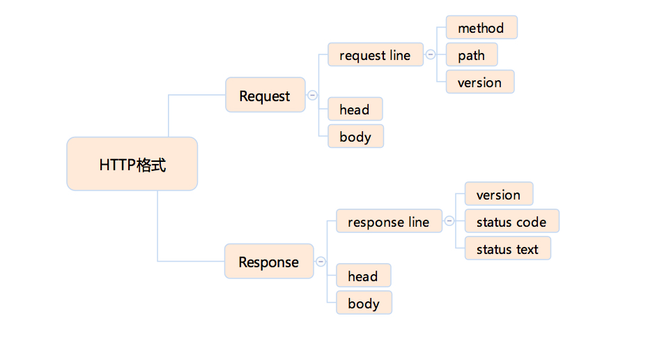
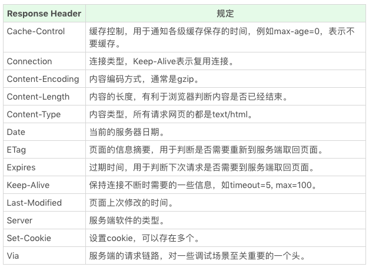

# 浏览器：一个浏览器是如何工作的？（阶段一）

前端开发者平时与浏览器打交道的时间最多，可浏览器对前端开发者来说更多的是像一个神秘的黑盒子，我们仅仅知道它能做什么，而不知道它是如何做到的。事实上，了解了浏览器工作原理的大致过程，不仅对前端面试中的考点有一点帮助，它还会在实际的工作中进行辅助增强，学习了浏览器的内部工作原理和个中缘由，对于我们做性能优化、排查错误都有很大好处。  
  
实际上，对浏览器的实现者来说，他们做的事情就是把一个 URL 变成屏幕上显示的网页，这个过程是这样的：  
  
1. 浏览器首先使用 HTTP 协议或者 HTTPS 协议，向服务端请求页面
2. 把请求回来的 HTML 代码经过解析，构建成 DOM 树
3. 计算 DOM 树上的 CSS 属性
4. 最后根据 CSS 属性对元素逐个进行渲染，得到内存中的位图
5. 一个可选的步骤是对位图进行合成，这会极大地增加后续绘制的速度
6. 合成之后再绘制到界面上

这里在从 HTTP 请求回来开始，这个过程并非一般想象中的一步做完再做下一步，它其实是一条流水线；从 HTTP 请求回来，就产生了流式的数据，后续的 DOM 树构建、CSS 计算、渲染、合成、绘制，都是尽可能地流式处理前一步的产出：即不需要等到上一步骤完全结束，就开始处理上一步的输出，这样我们在浏览网页的时候才会看到逐步出现的页面。  

## HTTP 协议

首先，浏览器要根据 URL 把数据取回来，取回数据使用的是 HTTP 协议(实际上这个过程之前还有 DNS 查询)；那么，由 IETF 组织制定的 HTTP 标准是怎样的，有如下两份：

1. HTTP1.1[https://tools.ietf.org/html/rfc2616](https://tools.ietf.org/html/rfc2616)
2. HTTP1.1[https://tools.ietf.org/html/rfc7234](https://tools.ietf.org/html/rfc7234)

HTTP 协议是基于 TCP 协议出现的，对 TCP 协议来说， TCP 协议是一条双向的通讯通道，HTTP 在 TCP 的基础上，规定了 Request-Response 的模式，这个模式决定了通讯必定是由浏览器首先发起的。  
  
大部分情况下，浏览器的实现者只需要用一个 TCP 库，甚至一个现成的 HTTP 库就可以搞定浏览器的网络通讯部分；HTTP 是纯粹的文本协议，它是规定了使用 TCP 协议来传输文本格式的一个应用层协议。  
  
下面用一个纯粹的 TCP 客户端来实现 HTTP 一下：  
这里需要用到一个 TCP 连接工具 telnet 客户端，首先运行 telnet 连接到极客时间主机，在命令行输入：

``` javascript
telnet time.geekbang.org 80
```

这个时候，TCP 连接已经建立，输入一下字符作为请求：

``` javascript
GET / HTTP/1.1
Host: time.geekbang.org
```

按下回车，这里可以收到服务端的回复：

``` javascript
HTTP/1.1 301 Moved Permanently
Date: Fri, 25 Jan 2019 13:28:12 GMT
Content-Type: text/html
Content-Length: 182
Connection: keep-alive
Location: https://time.geekbang.org/
Strict-Transport-Security: max-age=15768000

<html>
<head><title>301 Moved Permanently</title></head>
<body bgcolor="white">
<center><h1>301 Moved Permanently</h1></center>
<hr><center>openresty</center>
</body>
</html>
```

这其实就是一次完整的 HTTP 请求过程，这里可以看到，在 TCP 通道中传输的完全是文本信息。  
在请求部分，第一行被称作 request line，它分为三个部分：HTTP Method(请求方法)、请求路径和请求的协议和版本；  
在响应部分，第一行被称作 response line，它也分为三个部分：协议和版本、状态码和状态文本；  
紧随着 request line 或者 response line 之后，是请求头/响应头，这些由若干行组成，每行是用冒号分隔的名称和值；  
在头之后，以一个空行(两个换行符)为分隔，是请求体/响应体，请求体可能包含文件或者表单数据，响应体则是 html 代码。  

## HTTP 协议格式

通过前面的介绍，大致可以把 HTTP 协议分为如下部分：  


## HTTP Method

http 的方法有以下几种定义：

- GET
- POST
- HEAD
- PUT
- DELETE
- CONNECT
- OPTIONS
- TRACE

浏览器通过地址栏访问页面都是 GET 方法，表单提交才会产生 POST 方法；HEAD 则跟 GET 类似，只返回请求头，多数由 JavaScript 发起；PUT 和 DELETE 分别表示添加资源和删除资源，但实际上这只是语法的一种约定；CONNECT 现在多用于 HTTPS 和 WebSocket；OPTIONS 和 TRACE 一般用于调试，多数线上服务都不支持。

## HTTP Status code(状态码) 和 Status text(状态文本)

下面是 response line 的状态码和状态文本，常见的有以下几种：

- 1xx: 临时回应，表示客户端请继续
- 2xx: 请求成功
  - 200: 请求成功，最常见
- 3xx: 表示请求的目标有变化
  - 301&302: 永久性与临时性跳转
  - 304: 跟客户端缓存没有更新
-4xx: 客户端请求错误
  - 403: 无权限
  - 404: 表示请求页面不存在
  - 418: 一个来自 ietf 的愚人节玩笑
- 5xx: 服务端请求错误
  - 500: 服务端错误
  - 503: 服务端暂时性错误

对于 1xx 系列的状态码比较陌生，因为它的状态被浏览器 http 库直接处理了，不会让上层应用知晓；其它的状态码在工作中基本都有碰见，但是 304 状态是灭一个前端都应该知道的状态码，这个状态的前提是: 客户端本地已经有缓存的版本，并且在 Request 中告诉了服务端，当服务端通过实践或者 tag，发现没有更新的时候就会返回一个不含 body 的 304 状态。

## HTTP Head

HTTP 请求头可以看做一个键值对，原则上，HTTP 请求头也是一种数据，我们可以自由定义 HTTP 头和值，下面先看 Request Header:  
  
  
Rsponse Header:  
  
  
## HTTP Request Body

HTTP 请求的 body 主要用于提交表单场景，实际上，HTTP 请求的 body 是比较自由的，只要浏览器端发送的 body 服务端认可就行，常见的格式：

- application/json
- applicationx-www-form-urlencoded
- multipart/form-data
- text/xml

我们使用 html 的 form 标签提交产生的 html 请求，默认会产生 application/x-www-form-urlencoded 的数据格式，当有文件上传时，则会使用 multipart/form-data。

## HTTPS

在 HTTP 协议的基础上，HTTPS 和 HTTP2 规定了更复杂的内容，但是它基本保持了 HTTP 的设计思想，即使用的 Request-Response 模式。  
  
HTTPS 它有两个作用：一是确定请求的目标服务端身份；二是保证传输的数据不会被网络中间节点窃听或者篡改。  
  
HTTPS 的标准也是有 RFC 规定的，如下：  
[https://tools.ietf.org/html/rfc2818](https://tools.ietf.org/html/rfc2818)  
  
HTTPS 是使用加密通道来传输 HTTP 的内容，它会先和服务端建立一条 TLS 加密通道，而 TLS 构建与 TCP 协议之上，它实际上是对传输的内容做一次加密，所以从传输内容上看 HTTPS 和 HTTP 没有任何区别。  

## HTTP2

HTTP2 是 HTTP1.1 的升级版本，其详情链接 [https://tools.ietf.org/html/rfc7540](https://tools.ietf.org/html/rfc7540)。  
  
HTTP2.0 最大的改进是：一支持服务端推送；二支持 TCP 连接复用。  
  
服务端推送能够在客户端第一个请求到服务端是，提前把一部分内容推送给客户端放入缓存中，这可以避免客户端请求顺序带来的并行度不高从而导致的性能问题。  
  
TCP 连接复用，则使用同一个 TCP 连接来传输多个 HTTP 请求，避免了 TCP 连接建立时的三次握手开销，和初建 TCP 连接时传输窗口小的问题。

## 总结

这里大概从浏览器使用 HTTP 协议和 HTTPS 协议向服务端请求页面开始对浏览器的第一步工作进行了学习。