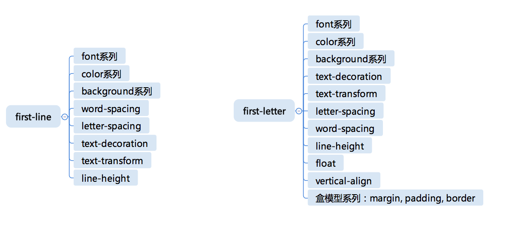

# CSS 选择器，伪元素是怎么回事

前面学习了一些简单选择器，这里继续对选择器的几个机制进行学习：选择器的组合、选择器的优先级和伪元素。  

## 选择器的组合

在 CSS 规则中，选择器部分是一个选择器列表。  
选择器列表是用逗号分隔的复杂选择器序列，复杂选择器则是用空格、大于号、波浪线等符号连接的复合选择器，复合选择器则是连写的简单选择器组合。  
根据选择器列表的语法，选择器的连接方式可以理解为像四则远算一样有优先级。  

- 第一优先级
  - 无连接符号
- 第二优先级
  - “空格”
  - “~”
  - “+”
  - “>”
  - “||”
- 第三优先级
  - “，”

如下选择器：  

``` javascript
.c, .a > .b.d {
  // code
}
```

其结构可以理解为：

- .c, .a > .b.d
  - .c
  - .a > .b.d
    - .a
    - .b.d
      - .b
      - .d

复合选择器表示简单选择器中“且”的关系，例如例子中的“.b.d”，表示选中的元素必须同时具有 b 和 d 两个 class。  
复杂选择器是针对节点关系的选择，它规定了五种连接符号。  

- “空格”：后代，表示选中所有符合条件的后代节点，例如“.a .b”表示选中所有具有 class 为 a 的后代节点中 class 为 b 的节点
- “>”：子代，表示选中符合条件的子节点，例如“.a > .b”表示选中所有具有 class 为 a 的子节点中 class 为 b 的节点
- “~”：后继，表示选中所有符合条件的后继节点，后继结点即跟当前节点具有同一个父元素，并出现在它之后的节点，例如“.a ~ .b”表示选中所有具有 class 为 a 的后继中，class 为 b 的节点
- “+”：直接后继：表示选中符合条件的直接后继结点，直接后继结点即 nextSibling。例如“.a + .b”表示选中所有具有 class 为 a 的下一个 class 为 b 的节点
- “||”：列选择器：表示选中对应列中符合条件的单元格

在实际使用中，比较常用的连接方式是 “空格” 和 “>”。  

而逗号表示 “或” 的关系，实际上，可以把它理解为“两条内容一样的 CSS 规则”的一种简写，如起那么的例子可以理解成下面这样：

``` javascript
.c {
  // code
}
.a > .b.d {
  // code
}
```

CSS 选择器是基于规则生效的，同一个元素命中多条规则是非常常见的事情，不同规则制定同一个属性为不同值时，就需要一个机制来解决冲突。这个既是接下来的内容：选择器优先级。  

## 选择器的优先级

CSS 标准用一个三元组(a,b,c)来构成一个负责选择器的优先级。  

- id 选择器的数据记为 a
- 伪类选择器和 class 选择器的数目记为 b
- 伪元素选择器和标签选择器数目记为 c
- “*” 不影响优先级

CSS 标准建议用一个足够大的进制，获取 “a-b-c” 来表示选择器优先级；即：

``` javascript
specificity = base * base * a + base * b + c
```

其中，base 是一个“足够大”的正整数，关于 base，历史中有些趣闻，早年 IE6 采用 256 进制，于是就产生了“256个 class 优先级等于一个 id”这样的奇葩问题，后来扩大到 65536，才基本避免了类似问题。  
而现代浏览器多采用了更大的数量，我们正常编写的 css 规则数量不太可能达到数万，因此我们就可以认为这样的 base 就不够大了。  
  
行内属性的优先级永远高于 CSS 规则，浏览器提供了一个“口子”，就是在选择器前加上“!import”；而这个用法是比较危险的，它相当于一个新的优先级，而且此优先级会高于行内属性。  
同一优先级的选择器遵循“后面的覆盖前面的”规则，如下：

``` javascript
<div id="my" class="x y">text</div>

.x {
  background-color: #f00;
}
.y {
  background-color: #000;
}
```

调换“.x” 和 “.y” 我们可以得到不同测显示效果，选择器的优先级是针对单条规则的，多条规则的选择器同时命中元素，优先级不会叠加。

``` javascript
<div id="my" class="x y z">text</div>

.x {
  background-color: #f00;
}
.y {
  background-color: #f00;
}
.z {
  background-color: #000;
}
```

在这个例子中，“.x” 和 “.y” 都制定了背景色为浅蓝色，但是因为 “.y” 规则在最后，所以最终显示结果为黑色；另一个需要注意的是，选择器的优先级是针对负责选择器的优先级，选择器列表不会合并计算优先级；如下：

``` javascript
<div id="my" class="x y z">text</div>

.x, .z {
  background-color: #f00;
}
.y {
  background-color: #000;
}
```

这里选择器列表 “.x, .z” 选中了 div，但它的两项分表计算优先级，所以最终优先级扔跟 “.y” 规则相同。  
所以实践中，建议“根据id选中单个元素” “class 和 class 的组合选成组元素” “tag选择器确定页面风格” 这样的简单原则来使用选择器，不要搞过于复杂的选择器。  

## 伪元素

简单选择器：伪元素；伪元素本身不单单是一种选择规则，它还是一种机制。伪元素的语法跟伪类相似，但是实际产生的效果却是把不存在的元素硬选出来。  
目前兼容性基本可用的伪元素有：

- ::first-line
- ::first-letter
- ::before
- ::after

**::first-line 和 ::first-letter 是比较类似的伪元素**，其中一个表示元素的第一行，一个表示元素的第一个字母。

``` javascript
<p>This is a somewhat long HTML
paragraph that will be broken into several
lines. The first line will be identified
by a fictional tag sequence. The other lines
will be treated as ordinary lines in the
paragraph.</p>

p::first-line {
  text-transform: uppercase;
}
```

这里的 style 把段落的第一行字母变成大写(这里的第一行指的是排版后显示的第一行，跟html代码中的换行无关)。  
  
::first-letter 则指第一个字母，首字母变大并向左浮动是一个非常常见的排版方式。

``` javascript
<p>This is a somewhat long HTML
paragraph that will be broken into several
lines. The first line will be identified
by a fictional tag sequence. The other lines
will be treated as ordinary lines in the
paragraph.</p>

p::first-letter {
  text-transform: uppercase;
  font-size:2em;
  float:left;
}
```

从这里看上去比较简单，但是实际上，我们遇到的 html 结构要更为复杂，一旦元素中不是纯文本，规则就变得复杂了。  
  
css 标准规定了 first-line 必须出现在最内层的块级元素之内，因此，下面代码：

``` javascript
<div>
  <p id=a>First paragraph</p>
  <p>Second paragraph</p>
</div>


div>p#a {
  color:green;
}

div::first-line {
  color:blue;
}
```

这段代码的最终结果第一行是蓝色，因为 p 是块级元素，所以伪元素出现在块级元素之内，所以内层的 color 覆盖了外层的 color 属性。  
如果我们把 p 换成 span，结果就会相反；如下：

``` javascript
<div>
  <span id=a>First paragraph</span><br>
  <span>Second paragraph</span>
</div>


div>p#a {
  color:green;
}

div::first-line {
  color:blue;
}
```

这里把 div 中的 p 标签换成 span 标签后，最终结果显示的是绿色，这说明伪元素在 span 之外。  
  
**::first-letter 的行为又有所不同，它的位置在所有标签之内**，我们前面的代码换成 ::first-letter。如下：

``` javascript
<div>
  <span id=a>First paragraph</span><br>
  <span>Second paragraph</span>
</div>


div>p#a {
  color:green;
}

div::first-letter {
  color:blue;
}
```

这里的 **::first-letter** 伪元素，首字母变成了蓝色，说明伪元素出现在 span 之内。  
  
css 标准只要求 ::first-line 和 ::first-letter 实现有限的几个 css 属性，都是文本相关，这些属性如下(winter老师)：  
  
  
**接下来还有两个伪元素 ::before 和 ::after**。  
这两个伪元素跟前面两个不同的是，它不是把已有的内容套上一个元素，而是真正的无中生有，造出一个元素。  
::before 表示在元素内容之前插入一个虚拟的元素，::after 则表示在元素内容之后插入。  
这两个伪元素所在的 css 必须制定 content 属性才会生效，如下：

``` javascript
<p class="aa">dom text content</p>

p.aa::before {
  display: block;
  content: '';
}
```

要注意的是，::before 和 ::after 还支持 content 为 counter，如下：

``` javascript
p.special::before {
  display: block;
  content: counter(chapno, upper-roman) ". ";
}
```

## 总结

这里学习了css选择器的三种机制：选择器的组合、选择器优先级、伪元素。最终的实现效果即需要灵活应用。