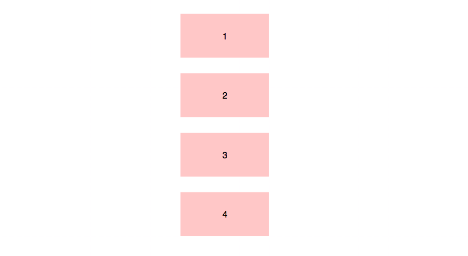

# CSS 排版：CSS 的正常流

css 是平时开发过程中必须使用的技术，那么，它的排版部分学习的怎么样？因为在前期css设计上不能够很好的支持在浏览器中的排版要求，需要开发者使用很多黑科技来进行处理，这就导致部分新人在接触的时候直接停止学习。  
而现在css提供了很多种的排版方式，在开发时也有很多选项可以选择合适自己的哪一种；然而，正常流却是开发者始终绕不过的一种排版话题。在网上能够找到很多关于正常流的话题，如：块级格式化上下文、margin 折叠等，这一系列内容听起来就很头痛。所以，又有很多人觉得很奇怪，正常流到底正常在哪里；事实上，我认为正常流是简单和符合直觉的东西；那么什么是正常流？  

## 正常流的行为

首先，对排版这个词做一个理解；在毕昇发明活字印刷之前，排版这项工作是不存在的，那时候人们想要印刷书籍就需要雕版工人去人工雕刻印版。  
活字印刷的出现，引入了排版的概念，排版是活字印刷的众多工序之一，而排版的过程是由工人一个字一个字从字架检出，再排入版框中，实际上，这个过程就是一个流式的处理过程。  
从古代的活字印刷，到现代的出版行业，再到今天的web，排版过程其实并没有什么本质的变化，只不过，今天在我们的css中，排版需要处理的内容不再是简单的大小相同的木字或者铅字，而是有着不同字体和字号的富文本，以及插入在富文本中的大小不等的盒子。  
并且，在这些过程中都会有一个正常流的存在，那么什么是正常流呢？  
**正常流的排版行为就是：依次排列，排不了就换行**。这个操作很简单，就算不懂排版的人也能够这样理解。  
理解了正常流的基本概念，在正常流的基础上，我们还有float相关规则，使得一些盒占据了正常流的空间，则我们可以把float理解为“文字环绕”。  
  
我们还有vertical-align相关规则规定了如何在垂直方向对齐盒，vertical-align相关规则看起来复杂，但是实际上，基线、文字顶/底、行顶/底都是我们正常书写文字时需要用到的概念，只是平时不一定会总结。  
下图展示了在不同的vertical-align设置时，盒与文字是如何混合排版的：  
  
除此之外，**margin 折叠**应该怎么理解呢？实际上我们可以把**margin 折叠**理解为“一个元素规定了自身周围至少需要的空间”，这样，就比较容易理解为什么margin需要折叠。

## 正常流的原理

前面描述了正常流的行为，接下来以比较严谨的模式来理解一下正常流。  
在css标准中，规定了如何排布每一个文字和盒的算法，这个算法依赖一个排版的“当前状态”，css把这个当前状态称为“块级格式化上下文”。  
而需要排版的盒分为 块级盒和行内盒，所以排版需要分别为它们规定块级格式化上下文和行内级格式化上下文。  
和正常流一样，单纯的看格式化上下文，规则其实也很简单；块级格式化上下文排列顺次排列元素：  
  
行内级格式化上下文顺次排列元素：  
  
当我们把正常流中的一个盒或者文字排版，需要分成三种情况：

- **遇到块级盒**：排入块级格式化上下文
- **遇到行内级盒或者文字**：首先尝试排入行内级格式化上下文，如果排不上，那么创建一个行盒，先将行盒排版(行盒是块级，所以到第一种情况)，行盒会创建一个行内级格式化上下文。
- **遇到float盒**：把盒的顶部跟当前行内级上下文上边缘对齐，然后根据float的方向把盒的对应边缘对到块级格式化上下文的边缘，然后重排当前行盒。

上面是一个块级格式化上下文中的排版规则，实际上，页面中的布局没那么简单，一些元素会在其内部创建新的块级格式化上下文，这些元素有：

- 浮动元素
- 绝对定位元素
- 非块级但仍能包含块级元素的容器(如：inline-block,table-cells,table-captions)
- 块级的能包含块级元素的容器，且属性overflow不为visible

这里的排版规则基本理清楚了，对一些书写技巧的掌握也很重要。

## 正常流的使用技巧

从等分布局和自适应宽度这两种经典布局入手。

- **等分布局问题**

横向等分布局是一个常见的需求，按照一般思路直接用百分比就可以解决，如下：

``` javascript
  <div class="outer">
    <div class="inner">1</div>
    <div class="inner">2</div>
    <div class="inner">3</div>
  </div>

  .inner {
    width: 33.3%;
    height: 200px;
    display: inline-block;
    outline: solid 1px blue;
  }
```

通过对 class 为 inner 的元素设置为 inline-block 和宽度达到了等分布局的效果。但是这段代码执行后跟预期效果不太一样，我们可以发现每个div并非紧挨，中间是有空白的，这是因为代码中加入了换行和空格文本，和inline盒混排了的缘故。  
解决方案是：

``` javascript
<div class="outer"><div class="inner">1</div><div class="inner">2</div>\<div class="inner">3</div></div>
```

但这样破坏了代码的可读性，一个变通的方案就是改变 outer 中的字号为 0。

``` javascript
.inner {
  width: 33.3%;
  height: 200px;
  display: inline-block;
  outline: solid 1px blue;
}
.outer {
  font-size: 0;
}
```

在某些浏览器中，因为像素计算精度问题还是会出现换行，我们可以给 outer 添加一个特定宽度：

``` javascript
.inner {
  width: 33.3%;
  height: 200px;
  display: inline-block;
  outline: solid 1px blue;
}
.outer {
  width: 101px;
}
```

但是这个代码在某些旧浏览器中任然会出现换行，为了保险起见，我们给最后一个 div 加上一个负的右 margin：

``` javascript
.outer {
  width: 101px;
}
.inner {
  width: 33.3%;
  height: 200px;
  display: inline-block;
  outline: solid 1px blue;
}
.inner:last-child {
  margin-right: -5px;
}
```

这样就搞定了，除了用 inline-block 外，float 也能达到同样的效果，但是 float 只能达到顶对齐，没有 inline-block 灵活。

- **自适应宽度**

在 IE6 时代，自适应宽(一个元素固定宽度，另外一个填满父元素的剩余宽度)是个老生常谈的问题，这里来说一下用正常流的解决方案；首先看一个案例：

``` javascript
<div class="outer">
  <div class="fixed">1</div>
  <div class="auto">2</div>
</div>

.fixed {
  width: 200px;
}
.fixed,
.auto {
  height: 300px;
  outline: solid 1px blue;
}
```

这里已经将 class 为 fixed 的 div 宽度设置好，需要添加 css 代码让 class 为 auto 的 div 填满剩余宽度；那么利用正常流的的解决思路就是利用负margin：

``` javascript
.fixed {
  display: inline-block;
  vertical-align: top;
}
.auto {
  margin-left: -200px;
  width: 100%;
  display: inline-block;
  vertical-align: top;
}
```

这样会导致 auto 中的内容位置不对，还需要使用 padding 把内容控制在正确的位置，最后：

``` javascript
.fixed {
  display: inline-block;
  vertical-align: top;
}
.auto {
  margin-left: -200px;
  padding-left: 200px;
  box-sizing: border-box;
  width: 100%;
  display: inline-block;
  vertical-align: top;
}
```

这样，利用 box-sizing 和 padding-left 这两个属性把内容放到了正确的位置。  
总的来说，正常流布局就是利用 inline-block 作为内容的容器，利用块级格式化上下文的纵向排布和行内级格式化上下文的横向排布来完成布局。

## 总结

这里学习的正常流，用一句话总结正常流的排版行为就是：依次排列，排不下就换行。